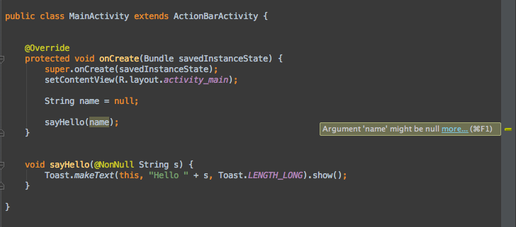
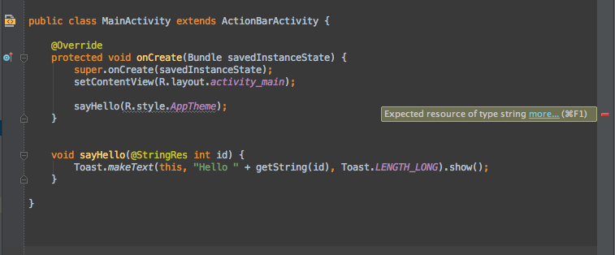
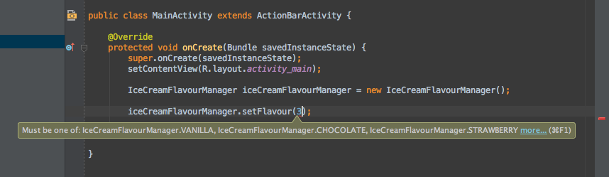
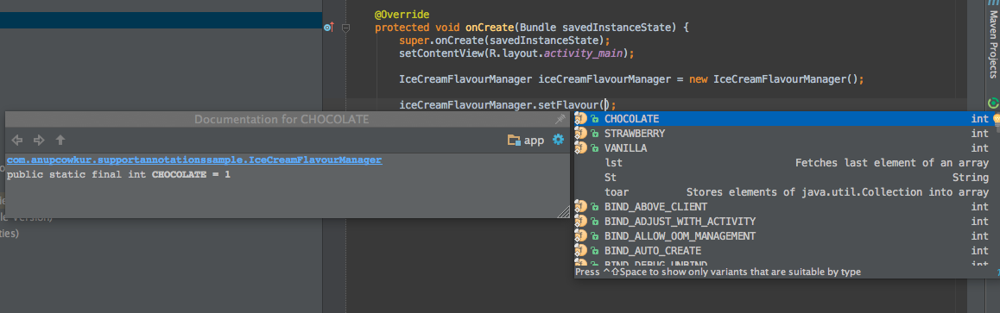

# Android Support Annotations 使用详解

来源：[www.codeceo.com](http://www.codeceo.com/article/android-support-annotations-2.html)

在Android Support Library19.1版本中，Android工具小组引入了几个很酷的注解类型，供开发者在工程中使用。Support Library自身也使用这些注解，这是一个好兆头。就让我们好好研究下。

通过gradle可以很容易的把这些注解添加到我们的工程中：

```
compile 'com.android.support:support-annotations:20.0.0'
```

有三种类型的注解可供我们使用：

* Nullness注解；
* 资源类型注解；
* IntDef和StringDef注解；

我们将通过代码例子来讲解每一种类型的作用以及在工程中如何使用它们。

## Nullness注解

使用`@NonNull`注解修饰的参数不能为null。在下面的代码例子中，我们有一个取值为null的name变量，它被作为参数传递给sayHello函数，而该函数要求这个参数是非null的String类型：

```
public class MainActivity extends ActionBarActivity {
    @Override
    protected void onCreate(Bundle savedInstanceState) {
        super.onCreate(savedInstanceState);
        setContentView(R.layout.activity_main);
        String name = null;
        sayHello(name);
    }

    void sayHello(@NonNull String s) {
        Toast.makeText(this, "Hello " + s, Toast.LENGTH_LONG).show();
    }
}
```

由于代码中参数String s使用@NonNull注解修饰，因此IDE将会以警告的形式提醒我们这个地方有问题：



如果我们给name赋值，例如`String name = “Our Lord Duarte”`，那么警告将消失。使用@Nullable注解修饰的函数参数或者返回值可以为null。假设User类有一个名为name的变量，使用`User.getName()`访问，那么我们可以编写如下代码：

```
public class MainActivity extends ActionBarActivity {
    @Override
    protected void onCreate(Bundle savedInstanceState) {
        super.onCreate(savedInstanceState);
        setContentView(R.layout.activity_main);
        User user = new User("Our Lord Duarte");
        Toast.makeText(this, "Hello " + getName(user), Toast.LENGTH_LONG).show();
    }
    @Nullable
    String getName(@NonNull User user) {
        return user.getName();
    }
}
```

因为getName函数的返回值使用@Nullable修饰，所以调用：

```
Toast.makeText(this, "Hello " + getName(user), Toast.LENGTH_LONG).show();
```

没有检查getName的返回值是否为空，将可能导致crash。

## 资源类型注解

是否曾经传递了错误的资源整型值给函数，还能够愉快的得到本来想要的整型值吗？资源类型注解可以帮助我们准确实现这一点。在下面的代码中，我们的sayHello函数预期接受一个字符串类型的id，并使用`@StringRes`注解修饰：

```
public class MainActivity extends ActionBarActivity {
    @Override
    protected void onCreate(Bundle savedInstanceState) {
        super.onCreate(savedInstanceState);
        setContentView(R.layout.activity_main);
        sayHello(R.style.AppTheme);
    }

    void sayHello(@StringRes int id) {
        Toast.makeText(this, "Hello " + getString(id), Toast.LENGTH_LONG).show();
    }
}
```

而我们传递了一个样式资源id给它，这时IDE将提示警告如下：



类似的，我们把警告的地方使用一个字符串资源id代替警告就消失了：

```
sayHello(R.string.name);
```

## IntDef和StringDef注解

我们要介绍的最后一种类型的注解是基于Intellij的“魔术常量”检查机制（[http://blog.jetbrains.com/idea/2012/02/new-magic-constant-inspection/](http://blog.jetbrains.com/idea/2012/02/new-magic-constant-inspection/)）

（我们不需要详细了解这个机制具体是如何实现的，想了解的话可以点击链接）。

很多时候，我们使用整型常量代替枚举类型（性能考虑），例如我们有一个`IceCreamFlavourManager`类，它具有三种模式的操 作：`VANILLA`，`CHOCOLATE`和`STRAWBERRY`。我们可以定义一个名为`@Flavour`的新注解，并使用`@IntDef`指定它可以接受的 值类型。

```
public class IceCreamFlavourManager {
    private int flavour;
    public static final int VANILLA = 0;
    public static final int CHOCOLATE = 1;
    public static final int STRAWBERRY = 2;
    @IntDef({VANILLA, CHOCOLATE, STRAWBERRY})
    public @interface Flavour {
    }
    @Flavour
    public int getFlavour() {
        return flavour;
    }
    public void setFlavour(@Flavour int flavour) {
        this.flavour = flavour;
    }
}
```

这时如果我们使用错误的整型值调用`IceCreamFlavourManager.setFlavour`时，IDE将报错如下：



IDE甚至会提示我们可以使用的有效的取值：



我们也可以指定整型值作为标志位，也就是说这些整型值可以使用’｜’或者’&’进行与或等操作。如果我们把`@Flavour`定义为如下标志位：

```
@IntDef(flag = true, value = {VANILLA, CHOCOLATE, STRAWBERRY})

    public @interface Flavour {

}
```

那么可以如下调用：

```
iceCreamFlavourManager.setFlavour(
		IceCreamFlavourManager.VANILLA 
		& IceCreamFlavourManager.CHOCOLATE);
```

`@StringDef`用法和`@IntDef`基本差不多，只不过是针对String类型而已。

关于将来计划增加哪些新的注解类型或者这些注解的依赖以及和Intellij自身的注解如何交互等等问题，可以查看网址：[http://tools.android.com/tech-docs/support-annotations](http://tools.android.com/tech-docs/support-annotations)。