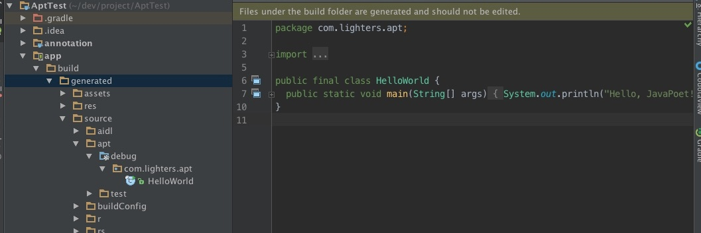

# Android编译期代码生成之apt实践入门
来源:[http://alighters.com/blog/2016/05/10/apt-code-generate/](http://alighters.com/blog/2016/05/10/apt-code-generate/)

现在 Android 主流库中使用 apt 的越来越多，如Dagger2，ButterKnife，DBflow等。不研究一下其怎么玩的，心里实在是不舒服斯基，所以就有了这篇apt代码简单生成的文章。文章的末尾，会附上一些关于注解的基础知识，有兴趣的童鞋可以再去看看。

## Annotation库-定义注解

首先，我们得需要新建一个名称为annotation的Java Library。这里简单的建一个@interfact的注解类即可。如下：

```
@Target(ElementType.TYPE)
@Retention(RetentionPolicy.CLASS)
public @interface Test {
    String value();
}
```

可以看到的是，这是编译时期的注解，主要作用于Class。之后，在调用的地方就是需要使用我们的这个注解。

## Compiler库-注解处理器

### 1.使用库引入

这里，也使用的是Java Library，我们把报名定为 compiler，先定义gradle文件：

```
apply plugin: 'java'

sourceCompatibility = 1.7
targetCompatibility = 1.7

dependencies {
    compile 'com.google.auto.service:auto-service:1.0-rc2'
    compile 'com.squareup:javapoet:1.7.0'
    compile project(':annotation')
}
```

代码中，引入两个库，[AutoService](https://github.com/google/auto/blob/master/service%2FREADME.md)主要的作用是注解processor类，并对其生成 META-INF 的配置信息。

[JavaPoet](https://github.com/square/javapoet)这个库的主要作用就是帮助我们通过类调用的形式来生成代码。

### 2. 定义Processor类

建立一个名称为TestProcessor的类，如下

```
@AutoService(Processor.class)
public class TestProcessor extends AbstractProcessor {

    @Override
    public Set<String> getSupportedAnnotationTypes() {
        return Collections.singleton(Test.class.getCanonicalName());
    }

    @Override
    public boolean process(Set<? extends TypeElement> annotations, RoundEnvironment roundEnv) {
        return false;
    }
}
```

其中要注意的是使用`AutoSerivce`的注解，这样就不用再手动配置 META-INF文件了。方法`getSupportedAnnotationTypes`则是定义我们针对生成的注解类，方法`process`则是我们的重头戏，其中则是我们生成代码的主要逻辑之处：

```
@Override
public boolean process(Set<? extends TypeElement> annotations, RoundEnvironment roundEnv) {
  Set<? extends Element> set = roundEnv.getElementsAnnotatedWith(Test.class);
  for (Element element : set) {
    if (element.getKind() != ElementKind.CLASS) {
      processingEnv.getMessager().printMessage(Diagnostic.Kind.ERROR, "only support class");
    }
    MethodSpec main = MethodSpec.methodBuilder("main")
      .addModifiers(Modifier.PUBLIC, Modifier.STATIC)
      .returns(void.class)
      .addParameter(String[].class, "args")
      .addStatement("$T.out.println($S)", System.class, "Hello, JavaPoet!")
      .build();

    TypeSpec helloWorld =
      TypeSpec.classBuilder("HelloWorld").addModifiers(Modifier.PUBLIC, Modifier.FINAL).addMethod(main).build();
    JavaFile javaFile = JavaFile.builder("com.lighters.apt", helloWorld).build();

    try {
      javaFile.writeTo(processingEnv.getFiler());
    } catch (IOException e) {
      e.printStackTrace();
    }
  }
  return false;
}
```

这里简单使用[JavaPoet](https://github.com/square/javapoet)文档中的第一个example, 生成一个简单的HelloWorld类。大家可自己行去查看JavaPoet的更多用法，支持各种姿势生成Java的代码，并与**Processor**完美契合。

## 代码调用

准备工作都完成之后，接下来就在我们的主目录app下面，通过添加注解，来查看我们的代码生成逻辑。

### 1.添加依赖

在根目录的build.gradle文件中的dependencies节点下面添加如下代码：

```
classpath 'com.neenbedankt.gradle.plugins:android-apt:1.8'
```
app的build.gradle中添加如下代码：

```
apply plugin: 'com.neenbedankt.android-apt'
dependencies {
    compile project(':annotation')
    apt project(':compiler')
}
```

### 2.添加注解

这里，就偷一个小懒，在**MainActivity**上，添加注解Test，格式如下：

```
@Test("haha")
public class MainActivity extends AppCompatActivity {
}
```

### 3.代码生成

注意，这里定义的注解为编译期的注解，所以代码的生成，只需要通过执行**Rebuild**即可。执行完成之后，在app的**build/generated/source/apt**目录下，即可看到咱们的代码，如图: 



## 总结

apt代码的生成是定义编译期的注解，再通过继承**Proccesor**实现代码生成逻辑，实现了编译期生成代码的逻辑。相对于在运行期通过反射来说，提高了程序的运行速度。这里只是简单引导大家搭建自己的apt处理器，更多的内容期待大家各自玩出花来。

## 学习资料

附上一篇标准的编译期代码生成，以及trinea关于annotation的详细介绍。

[Annotation实战【自定义AbstractProcessor】](http://www.cnblogs.com/avenwu/p/4173899.html)<br/>
[Java Annotation 及几个常用开源项目注解原理简析](http://www.trinea.cn/android/java-annotation-android-open-source-analysis/)<br/>

另外，使用apt的代码库[Dagger2](https://github.com/google/dagger), [Butterknife](https://github.com/JakeWharton/butterknife)大家可自行深入研究了。

> 版权归作者所有，转载请注明原文链接：[http://alighters.com/blog/2016/05/10/apt-code-generate/](http://alighters.com/blog/2016/05/10/apt-code-generate/)