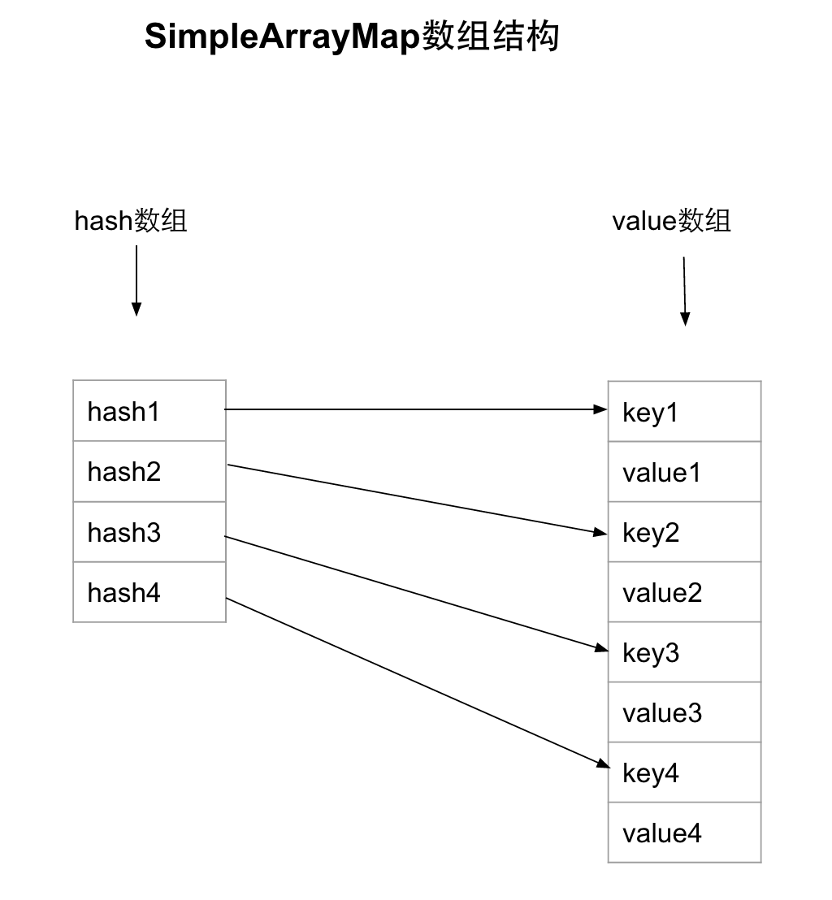
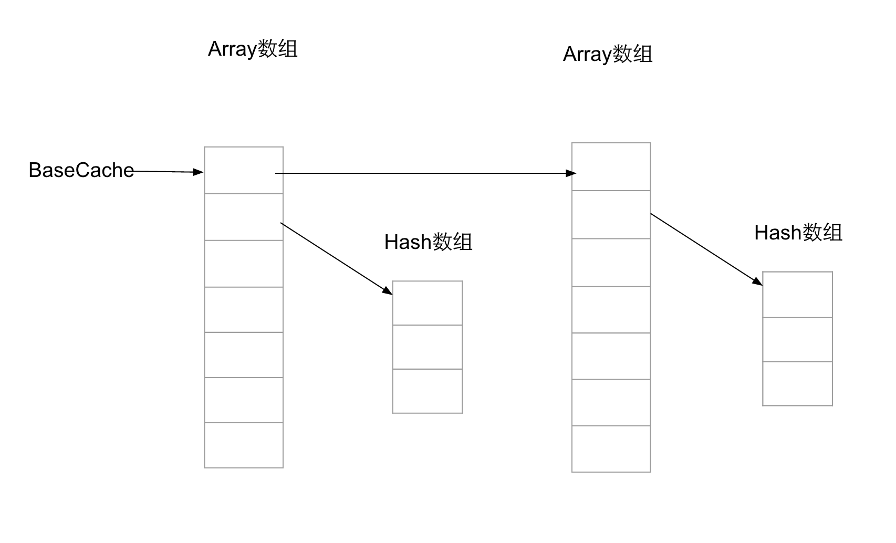

# SimpleArrayMap源码解析

来源:[alighters.com](http://alighters.com/blog/2016/04/29/simplearraymapyuan-ma-jie-xi/)

> 本文SimpleArrayMap源码分析是基于support v4 23.3.0版本的。 另外，因ArrayMap涉及的多是算法知识，而主要的思想比较简单，所以本文会主要以代码为主，细讲其每个实现。

## 为什么要引入ArrayMap？

在Android设备上，因为App的内存限制，出现OOM的错误，导致开发者不得不关注一些底层数据结构以及去分析App的内存使用情况。提及数据结构，HashMap是我们最经常使用到的，而我们是否会注意其实现的细节以及有什么优缺点呢？

这里简单提及一下HashMap在扩容时采取的做法是：将当前的数据结构所占空间*2，而这对安卓稀缺的资源来说，可是非常大的消耗。所以就诞生了ArrayMap，它是在API19引入的，这样我们在兼容以前版本的时候，support包就派上用场了，可是为什么不直接是使用ArrayMap，而会多出来一个SimpleArrayMap呢？不得不说这是谷歌的厚道、人性化处，考虑我们使用ArrayMap时，可能不需要使用Java标准的集合API，而给我们提供的一个纯算法实现的ArrayMap。

上面提到的集合API，是SimpleArrayMap跟v4包中的ArrayMap最大的区别，证明就是ArrayMap继承了SimpleArrayMap，又实现了Map的接口；主要的操作，则是通过引入MapCollections类，使用Map中的Entry结构，这样在ArrayMap中就可以通过`Iterator`来进行数据的的迭代操作。

## 实现思想

简单地了解一下其思想，是我们接下来进行源码分析的必要步骤，方便我们带着问题去验证我们所想。兵马未动，粮草先行。做事前一定要先把准备工作做好，事情理顺，尽量地充分考虑工作的细节 ，再开始进行工作。正如我们现在项目开发之前，一定要先进行任务点的分解，而这时思维导图、UML建模工具则是我们必须玩转的东西。

思想：SimpleArrayMap采用了两个数组来进行hash值与key、value值得保存，另外，数组大小超过8时，并需要进行扩容时，只增大当前数组大小的一半，并对大小为4和8的数组进行缓存。这样最后带来的好处就是最大程度保证了数组空间都能够被使用，一定程度上避免了内存空间的浪费。

数据结构方式：使用了两个数组，一个是Hash数组，另一个是**大小*2**的Array数组，为了保证通用性，这里所使用的是Object数组。Array数组中使用key+value间隔存取的方式，偶数为即`0 -> key1 1 -> value1 2 -> key2 3 -> value2`。另外Hash数组，则是对应的Key的Hash值数组，并且这是一个有序的int数组，这样在进行Key的查找时，使用二分查找则是最有效率的方式了。如下图：



## 数据结构定义

### 1.数据结构

```
int[] mHashes;
Object[] mArray;
int mSize;
```

代码中，`mHashes`数组为`mArray`中的key对应的hash值得数组，而`mArray`即是HashMap中key与value间隔混合的一个数组。

### 2.初始化

默认构造器(初始大小为0)

```
/**
 * Create a new empty ArrayMap.  The default capacity of an array map is 0, and
 * will grow once items are added to it.
 */
public SimpleArrayMap() {
   mHashes = ContainerHelpers.EMPTY_INTS;
   mArray = ContainerHelpers.EMPTY_OBJECTS;
   mSize = 0;
}
```

指定初始大小

```
 * Create a new ArrayMap with a given initial capacity.
 */
public SimpleArrayMap(int capacity) {
   if (capacity == 0) {
      mHashes = ContainerHelpers.EMPTY_INTS;
      mArray = ContainerHelpers.EMPTY_OBJECTS;
   } else {
      allocArrays(capacity);
   }
   mSize = 0;
}
```

通过SimpleArrayMap赋值

```
/**
 * Create a new ArrayMap with the mappings from the given ArrayMap.
 */
public SimpleArrayMap(SimpleArrayMap map) {
   this();
   if (map != null) {
      putAll(map);
   }
}
```

### 3.释放

```
/**
 * Make the array map empty.  All storage is released.
 */
public void clear() {
   if (mSize != 0) {
      freeArrays(mHashes, mArray, mSize);
      mHashes = ContainerHelpers.EMPTY_INTS;
      mArray = ContainerHelpers.EMPTY_OBJECTS;
      mSize = 0;
   }
}
```

代码中提及的EMPTY_INTS及EMPTY_OBJECTS，仅仅如下的两个空数组:

```
static final int[] EMPTY_INTS = new int[0];

static final Object[] EMPTY_OBJECTS = new Object[0];
```

## 算法

### 1. 存数据put(key, value)

存数据的操作，按我们数据结构的定义，应该是需要针对key，获取其对应的hash值，在Hash数组中，采取二分查找，定位到指定hash值所对应的index值；之后根据index值，来调整并存放key跟value的值。来看看源码的实现吧：

```
/**

 * Add a new value to the array map.

 * @param key The key under which to store the value.  <b>Must not be null.</b>  If

 * this key already exists in the array, its value will be replaced.

 * @param value The value to store for the given key.

 * @return Returns the old value that was stored for the given key, or null if there

 * was no such key.

 */

public V put(K key, V value) {

   final int hash;

   int index;

   if (key == null) {

      // 查找key为null的情况

      hash = 0;

      index = indexOfNull();

   } else {

      hash = key.hashCode();

      index = indexOf(key, hash);

   }

   if (index >= 0) {

      // 数组中存在相同的key，则更新并返回旧的值

      index = (index<<1) + 1;

      final V old = (V)mArray[index];

      mArray[index] = value;

      return old;

   }

   index = ~index;

   if (mSize >= mHashes.length) {

      // 当容量不够时，需要建立一个新的数组，来进行扩容操作。

      final int n = mSize >= (BASE_SIZE*2) ? (mSize+(mSize>>1))

         : (mSize >= BASE_SIZE ? (BASE_SIZE*2) : BASE_SIZE);


      if (DEBUG) Log.d(TAG, "put: grow from " + mHashes.length + " to " + n);


      final int[] ohashes = mHashes;

      final Object[] oarray = mArray;

      allocArrays(n);

      if (mHashes.length > 0) {

         if (DEBUG) Log.d(TAG, "put: copy 0-" + mSize + " to 0");

         System.arraycopy(ohashes, 0, mHashes, 0, ohashes.length);

         System.arraycopy(oarray, 0, mArray, 0, oarray.length);

      }


      freeArrays(ohashes, oarray, mSize);

   }

   // 将index之后的数据进行后移

   if (index < mSize) {

      if (DEBUG) Log.d(TAG, "put: move " + index + "-" + (mSize-index)

            + " to " + (index+1));

      System.arraycopy(mHashes, index, mHashes, index + 1, mSize - index);

      System.arraycopy(mArray, index << 1, mArray, (index + 1) << 1, (mSize - index) << 1);

   }

   // 赋值给index位置上hash值

   mHashes[index] = hash;

   // 更新array数组中对应的key跟value值。

   mArray[index<<1] = key;

   mArray[(index<<1)+1] = value;

   mSize++;

   return null;

}

```

代码中，可以看出arrayMap允许key为空，所有的key都不能重复。 另外，在进行容量修改的时候，进行的操作是：mSize跟hash数组长度的判断，当大于等于的时候，需要对数组的容量进行一些扩容，并拷贝数组到新的数组中。（扩容操作：当size大于8, 取size + size /2 ; 当size大于4小于8时， 取8 ，当size小于4时，取4）

### 2. 取数据get（key)

```
/**
 * Retrieve a value from the array.
 * @param key The key of the value to retrieve.
 * @return Returns the value associated with the given key,
 * or null if there is no such key.
 */
public V get(Object key) {
   final int index = indexOfKey(key);
   return index >= 0 ? (V)mArray[(index<<1)+1] : null;
}
```

通过key来获取数据就非常简单了，根据key获取到相应的index值，在array数据中根据index乘2加1返回相应的value即可。

### 3. 删除数据remove（key）

```
/**

 * Remove an existing key from the array map.

 * @param key The key of the mapping to remove.

 * @return Returns the value that was stored under the key, or null if there

 * was no such key.

 */

public V remove(Object key) {
   final int index = indexOfKey(key);
   if (index >= 0) {
      return removeAt(index);
   }
   return null;
}
```

根据key来删除时，先会根据key来获取其对应的index值，再通过removeAt(int index)方法来进行删除操作。

```
/**

 * Remove the key/value mapping at the given index.

 * @param index The desired index, must be between 0 and {@link #size()}-1.

 * @return Returns the value that was stored at this index.

 */

public V removeAt(int index) {

   final Object old = mArray[(index << 1) + 1];

   if (mSize <= 1) {

      // Now empty.

      if (DEBUG) Log.d(TAG, "remove: shrink from " + mHashes.length + " to 0");

      freeArrays(mHashes, mArray, mSize);

      mHashes = ContainerHelpers.EMPTY_INTS;

      mArray = ContainerHelpers.EMPTY_OBJECTS;

      mSize = 0;

   } else {

      // 满足条件，对数组进行加入缓存的操作。

      if (mHashes.length > (BASE_SIZE*2) && mSize < mHashes.length/3) {

         // Shrunk enough to reduce size of arrays.  We don't allow it to

         // shrink smaller than (BASE_SIZE*2) to avoid flapping between

         // that and BASE_SIZE.

         final int n = mSize > (BASE_SIZE*2) ? (mSize + (mSize>>1)) : (BASE_SIZE*2);


         if (DEBUG) Log.d(TAG, "remove: shrink from " + mHashes.length + " to " + n);


         final int[] ohashes = mHashes;

         final Object[] oarray = mArray;

         allocArrays(n);


         mSize--;

         if (index > 0) {

            if (DEBUG) Log.d(TAG, "remove: copy from 0-" + index + " to 0");

            System.arraycopy(ohashes, 0, mHashes, 0, index);

            System.arraycopy(oarray, 0, mArray, 0, index << 1);

         }

         if (index < mSize) {

            if (DEBUG) Log.d(TAG, "remove: copy from " + (index+1) + "-" + mSize

                  + " to " + index);

            System.arraycopy(ohashes, index + 1, mHashes, index, mSize - index);

            System.arraycopy(oarray, (index + 1) << 1, mArray, index << 1,

                  (mSize - index) << 1);

         }

      } else {

         mSize--;

         if (index < mSize) {

            if (DEBUG) Log.d(TAG, "remove: move " + (index+1) + "-" + mSize

                  + " to " + index);

            System.arraycopy(mHashes, index + 1, mHashes, index, mSize - index);

            System.arraycopy(mArray, (index + 1) << 1, mArray, index << 1,

                  (mSize - index) << 1);

         }

         mArray[mSize << 1] = null;

         mArray[(mSize << 1) + 1] = null;

      }

   }

   return (V)old;

}
```

这里先忽略hash数组长度的判断（主要进行数组缓存的操作）只看主要的代码，即最后的一个else的代码，使用System.arraycopy方法将hash数组跟array数组中index之后的数据往前移动1位，而将最后一位的数据进行至空。

### 4. indexOfKey (key)

上面代码中，都可以看到`indexOfKey`身影的出现，来看到其中如何实现的：

```
/**

 * Returns the index of a key in the set.

 *

 * @param key The key to search for.

 * @return Returns the index of the key if it exists, else a negative integer.

 */

public int indexOfKey(Object key) {

   return key == null ? indexOfNull() : indexOf(key, key.hashCode());

}
```

由上发现允许key为null，进行index的查询，当key不为空时，通过key及其key的hashCode,来进行查询。

```
int indexOf(Object key, int hash) {

   final int N = mSize;


   // Important fast case: if nothing is in here, nothing to look for.

   if (N == 0) {

      return ~0;

   }

   int index = ContainerHelpers.binarySearch(mHashes, N, hash);

   // If the hash code wasn't found, then we have no entry for this key.

   if (index < 0) {

      return index;

   }

   // If the key at the returned index matches, that's what we want.

   if (key.equals(mArray[index<<1])) {

      return index;

   }

   // Search for a matching key after the index.

   int end;

   for (end = index + 1; end < N && mHashes[end] == hash; end++) {

      if (key.equals(mArray[end << 1])) return end;

   }

   // Search for a matching key before the index.

   for (int i = index - 1; i >= 0 && mHashes[i] == hash; i--) {

      if (key.equals(mArray[i << 1])) return i;

   }

   // Key not found -- return negative value indicating where a

   // new entry for this key should go.  We use the end of the

   // hash chain to reduce the number of array entries that will

   // need to be copied when inserting.

   return ~end;
}
```

代码中，是先对Hash数组进行二分查找，获取index，之后根据index获取hash数组中对应的值，通过与key来比较是否相等，相等则直接返回，若不相等，则先从index之后的数据进行比较，没找到，则再找之前的数据。可以看出这样是支持存在多个key的hash值相同的情况，那再看看支不支持多个key为null的情况呢？

```
int indexOfNull() {
   final int N = mSize;

   // Important fast case: if nothing is in here, nothing to look for.
   if (N == 0) {
      return ~0;
   }

   int index = ContainerHelpers.binarySearch(mHashes, N, 0);

   // If the hash code wasn't found, then we have no entry for this key.
   ！if (index < 0) {
      return index;
   }

   // If the key at the returned index matches, that's what we want.
   if (null == mArray[index<<1]) {
      return index;
   }

   // Search for a matching key after the index.
   int end;
   for (end = index + 1; end < N && mHashes[end] == 0; end++) {
      if (null == mArray[end << 1]) return end;
   }

   // Search for a matching key before the index.
   for (int i = index - 1; i >= 0 && mHashes[i] == 0; i--) {
      if (null == mArray[i << 1]) return i;
   }

   // Key not found -- return negative value indicating where a
   // new entry for this key should go.  We use the end of the
   // hash chain to reduce the number of array entries that will
   // need to be copied when inserting.
   return ~end;
}
```

从上可以看出当key为null的时候，采取获取的方法跟key不为null获取是很相似的了，都要进行整个数组的遍历，不过这里对应的hash都是为0。但key为null只能在数组中存在一个的，因为在数据的put操作的时候，会对key进行检查，这样保证了key为null只能存在一个。

### 5.二分查找

这里，回顾一下，上面代码中一直会用到的，经典的二分查找的算法：

```
// This is Arrays.binarySearch(), but doesn't do any argument validation.
static int binarySearch(int[] array, int size, int value) {
   int lo = 0;
   int hi = size - 1;

   while (lo <= hi) {
      int mid = (lo + hi) >>> 1;
      int midVal = array[mid];

      if (midVal < value) {
         lo = mid + 1;
      } else if (midVal > value) {
         hi = mid - 1;
      } else {
         return mid;  // value found
      }
   }
   return ~lo;  // value not present
}
```

代码中，采用右移操作来进行除2的操作，而通过三个大于号，则表示无符号操作。

## 缓存的实现

讲到这里，就基本可以结束了，而源码中看到了两个神奇的数组，他俩主要的目的是对固定的数组来进行缓存，官方给的说法是避免内存抖动，毕竟这里是纯数组来实现的，而当数组容量不够的时候，就需要建立一个新的数组，这样旧的数组不就浪费了，所以这里的缓存还是灰常必要的。接下来看看他俩是怎样玩的，不感兴趣的可以略过这里了。先看一下数据结构的实现：

### 1.数据结构

```
/**
 * The minimum amount by which the capacity of a ArrayMap will increase.
 * This is tuned to be relatively space-efficient.
 */
private static final int BASE_SIZE = 4;

/**
 * Maximum number of entries to have in array caches.
 */
private static final int CACHE_SIZE = 10;

/**
 * Caches of small array objects to avoid spamming garbage.  The cache
 * Object[] variable is a pointer to a linked list of array objects.
 * The first entry in the array is a pointer to the next array in the
 * list; the second entry is a pointer to the int[] hash code array for it.
 */
static Object[] mBaseCache;
static int mBaseCacheSize;
static Object[] mTwiceBaseCache;
static int mTwiceBaseCacheSize;
```

代码中有两个静态的Object数组，这两个静态数组采用链表的方式来缓存所有的数组。即Object数组会用来指向array数组，而这个array的第一个值为指针，指向下一个array，而第二个值是对应的hash数组，其他的值则为空。另外，缓存数组即baseCache和twiceBaseCache，它俩大小容量的限制：最小值为4，最大值为10，而BaseCache数组主要存储的是容量为4的数组，twiceBaseCache主要存储容量为8的数组。如图：



### 2.缓存数据添加

```
private static void freeArrays(final int[] hashes, final Object[] array, final int size) {
   if (hashes.length == (BASE_SIZE*2)) {
      synchronized (ArrayMap.class) {
         if (mTwiceBaseCacheSize < CACHE_SIZE) {
            array[0] = mTwiceBaseCache;
            array[1] = hashes;
            for (int i=(size<<1)-1; i>=2; i--) {
               array[i] = null;
            }
            mTwiceBaseCache = array;
            mTwiceBaseCacheSize++;
            if (DEBUG) Log.d(TAG, "Storing 2x cache " + array
                  + " now have " + mTwiceBaseCacheSize + " entries");
         }
      }
   } else if (hashes.length == BASE_SIZE) {
      synchronized (ArrayMap.class) {
         if (mBaseCacheSize < CACHE_SIZE) {
            array[0] = mBaseCache;
            array[1] = hashes;
            for (int i=(size<<1)-1; i>=2; i--) {
               array[i] = null;
            }
            mBaseCache = array;
            mBaseCacheSize++;
            if (DEBUG) Log.d(TAG, "Storing 1x cache " + array
                  + " now have " + mBaseCacheSize + " entries");
         }
      }
   }
}
```

这个方法主要调用的地方在于ArrayMap进行容量改变时，代码中，会对当前数组的array进行清空操作，但第一个值指向之前cache数组，第二个值指向hash数组。

### 3.缓存数组使用

```
private void allocArrays(final int size) {
   if (size == (BASE_SIZE*2)) {
      synchronized (ArrayMap.class) {
         if (mTwiceBaseCache != null) {
            final Object[] array = mTwiceBaseCache;
            mArray = array;
            mTwiceBaseCache = (Object[])array[0];
            mHashes = (int[])array[1];
            array[0] = array[1] = null;
            mTwiceBaseCacheSize--;
            if (DEBUG) Log.d(TAG, "Retrieving 2x cache " + mHashes
                  + " now have " + mTwiceBaseCacheSize + " entries");
            return;
         }
      }
   } else if (size == BASE_SIZE) {
      synchronized (ArrayMap.class) {
         if (mBaseCache != null) {
            final Object[] array = mBaseCache;
            mArray = array;
            mBaseCache = (Object[])array[0];
            mHashes = (int[])array[1];
            array[0] = array[1] = null;
            mBaseCacheSize--;
            if (DEBUG) Log.d(TAG, "Retrieving 1x cache " + mHashes
                  + " now have " + mBaseCacheSize + " entries");
            return;
         }
      }
   }

   mHashes = new int[size];
   mArray = new Object[size<<1];
}
```

这个时候，当size跟缓存的数组大小相同，即要么等于4，要么等于8，即可从缓存中拿取数组来用。这里主要的操作就是baseCache指针的移动，指向array[0]指向的指针，hash数组即为array[0]，而当前的这个array咱们就可以使用了。

## 总结

* SimpleArrayMap是可以替代ArrayMap来使用的，区别只是其内部采用单纯的数组来实现，而ArrayMap中采用了EntrySet跟KeySet的结构，这样方便使用Iterator来数据的遍历获取。
* ArrayMap适用于少量的数据，因为存取的复杂度，对数量过大的就不太合适。这个量笔者建议破百就放弃ArrayMap的使用吧。
* ArrayMap支持key为null，但数组只能有一个key为null的存在。另外，允许多个key的hash值相同，不过尽量避免吧，不然二分查找获取不到，又会进行遍历查找；而key都必须是唯一，不能重复的。
* 主要目的是避免占用大量的内存切无法得到地充分利用。
* 对容量为4和容量为8的数组，进行缓存，来防止内存抖动的发生。

> PS: 转载请注明原文链接
