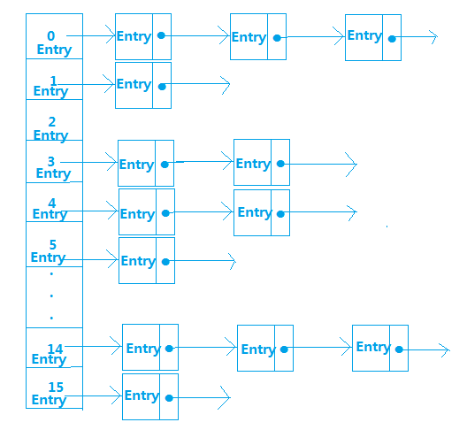
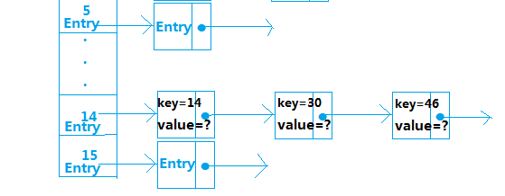

# Android内存优化-使用SparseArray和ArrayMap代替HashMap

来源:[http://www.codes51.com/article/detail_163576.html](http://www.codes51.com/article/detail_163576.html)

在Android开发时，我们使用的大部分都是Java的api，比如HashMap这个api，使用率非常高，但是对于Android这种对内存非常敏感的移动平台，很多时候使用一些java的api并不能达到更好的性能，相反反而更消耗内存，所以针对Android这种移动平台，也推出了更符合自己的api，比如SparseArray、ArrayMap用来代替HashMap在有些情况下能带来更好的性能提升。
介绍它们之前先来介绍一下HashMap的内部存储结构，就明白为什么推荐使用SparseArray和ArrayMap

## HashMap

HashMap内部是使用一个默认容量为16的数组来存储数据的，而数组中每一个元素却又是一个链表的头结点，所以，更准确的来说，HashMap内部存储结构是使用哈希表的拉链结构（数组+链表），如图： 

这种存储数据的方法叫做拉链法 



且每一个结点都是Entry类型，那么Entry是什么呢？我们来看看HashMap中Entry的属性：

```
final K key;
V value;
finalint hash;
HashMapEntry<K, V> next;
```

从中我们得知Entry存储的内容有key、value、hash值、和next下一个Entry，那么，这些Entry数据是按什么规则进行存储的呢？就是通过计算元素key的hash值，然后对HashMap中数组长度取余得到该元素存储的位置，计算公式为hash(key)%len，比如：假设`hash(14)=14,hash(30)=30,hash(46)=46`，我们分别对len取余，得到 
`hash(14)%16=14，hash(30)%16=14，hash(46)%16=14`，所以key为14、30、46的这三个元素存储在数组下标为14的位置，如： 



从中可以看出，如果有多个元素key的hash值相同的话，后一个元素并不会覆盖上一个元素，而是采取链表的方式，把之后加进来的元素加入链表末尾，从而解决了hash冲突的问题，由此我们知道HashMap中处理hash冲突的方法是链地址法，在此补充一个知识点，处理hash冲突的方法有以下几种：

* 开放地址法
* 再哈希法
* 链地址法
* 建立公共溢出区

讲到这里，重点来了，我们知道HashMap中默认的存储大小就是一个容量为16的数组，所以当我们创建出一个HashMap对象时，即使里面没有任何元素，也要分别一块内存空间给它，而且，我们再不断的向HashMap里put数据时，当达到一定的容量限制时（这个容量满足这样的一个关系时候将会扩容：HashMap中的数据量>容量*加载因子，而HashMap中默认的加载因子是0.75），HashMap的空间将会扩大，而且扩大后新的空间一定是原来的2倍，我们可以看put()方法中有这样的一行代码：

```
int newCapacity = oldCapacity * 2;
```

所以，重点就是这个，只要一满足扩容条件，HashMap的空间将会以2倍的规律进行增大。假如我们有几十万、几百万条数据，那么HashMap要存储完这些数据将要不断的扩容，而且在此过程中也需要不断的做hash运算，这将对我们的内存空间造成很大消耗和浪费，而且HashMap获取数据是通过遍历Entry[]数组来得到对应的元素，在数据量很大时候会比较慢，所以在Android中，HashMap是比较费内存的，我们在一些情况下可以使用SparseArray和ArrayMap来代替HashMap。

## SparseArray

SparseArray比HashMap更省内存，在某些条件下性能更好，主要是因为它避免了对key的自动装箱（int转为Integer类型），它内部则是通过两个数组来进行数据存储的，一个存储key，另外一个存储value，为了优化性能，它内部对数据还采取了压缩的方式来表示稀疏数组的数据，从而节约内存空间，我们从源码中可以看到key和value分别是用数组表示：

```
privateint[] mKeys;
private Object[] mValues;
```

我们可以看到，SparseArray只能存储key为int类型的数据，同时，SparseArray在存储和读取数据时候，使用的是二分查找法，我们可以看看：

```
public void put(int key, E value) {
	int i = ContainerHelpers.binarySearch(mKeys, mSize, key);
	...
}
public E get(int key, E valueIfKeyNotFound) {
	int i = ContainerHelpers.binarySearch(mKeys, mSize, key);
	...
}
```

也就是在put添加数据的时候，会使用二分查找法和之前的key比较当前我们添加的元素的key的大小，然后按照从小到大的顺序排列好，所以，SparseArray存储的元素都是按元素的key值从小到大排列好的。 

而在获取数据的时候，也是使用二分查找法判断元素的位置，所以，在获取数据的时候非常快，比HashMap快的多，因为HashMap获取数据是通过遍历Entry[]数组来得到对应的元素。

```
// 添加数据
publicvoidput(int key, E value)

//删除数据
publicvoidremove(int key)

// or

publicvoiddelete(int key)

// 其实remove内部还是通过调用delete来删除数据的

// 获取数据
public E get(int key)

// or

public E get(int key, E valueIfKeyNotFound)

// 该方法可设置如果key不存在的情况下默认返回的value
```

* 特有方法

在此之外，SparseArray还提供了两个特有方法，更方便数据的查询： 

```
// 获取对应的key：
publicintkeyAt(int index)

// 获取对应的value：
public E valueAt(int index)
```

SparseArray应用场景：

虽说SparseArray性能比较好，但是由于其添加、查找、删除数据都需要先进行一次二分查找，所以在数据量大的情况下性能并不明显，将降低至少50%。

满足下面两个条件我们可以使用SparseArray代替HashMap：

* 数据量不大，最好在千级以内

* key必须为int类型，这中情况下的HashMap可以用SparseArray代替：

```
HashMap<Integer, Object> map = new HashMap<>();
```

用SparseArray代替:

```
SparseArray<Object> array = new SparseArray<>();
```

## ArrayMap

这个api的资料在网上可以说几乎没有，然并卵，只能看文档了 

ArrayMap是一个<key,value>映射的数据结构，它设计上更多的是考虑内存的优化，内部是使用两个数组进行数据存储，一个数组记录key的hash值，另外一个数组记录Value值，它和SparseArray一样，也会对key使用二分法进行从小到大排序，在添加、删除、查找数据的时候都是先使用二分查找法得到相应的index，然后通过index来进行添加、查找、删除等操作，所以，应用场景和SparseArray的一样，如果在数据量比较大的情况下，那么它的性能将退化至少50%。

```
//添加数据
public V put(K key, V value)

// 获取数据
public V get(Objectkey)

// 删除数据
public V remove(Objectkey)
```

特有方法

它和SparseArray一样同样也有两个更方便的获取数据方法：

```
public K keyAt(int index)
public V valueAt(int index)
```

ArrayMap应用场景

* 数据量不大，最好在千级以内
* 数据结构类型为Map类型

```
ArrayMap<Key,Value> arrayMap = new ArrayMap<>();
```

## 总结
SparseArray和ArrayMap都差不多，使用哪个呢？ 

假设数据量都在千级以内的情况下：

* 1、如果key的类型已经确定为int类型，那么使用SparseArray，因为它避免了自动装箱的过程，如果key为long类型，它还提供了一个LongSparseArray来确保key为long类型时的使用
* 2、如果key类型为其它的类型，则使用ArrayMap

版权声明：本文为博主原创文章，未经博主允许不得转载。转载注明出处：[http://blog.csdn.net/u010687392](http://blog.csdn.net/u010687392)

延伸阅读：

* [Android性能优化之使用SparseArray代替HashMap](http://www.codes51.com/article/detail_166503.html)
* [android中HashMap的替代者——SparseArray 源码分析](http://www.codes51.com/article/detail_170161.html)

以上就介绍了Android内存优化（使用SparseArray和ArrayMap代替HashMap），包括了方面的内容，希望对Android开发有兴趣的朋友有所帮助。
