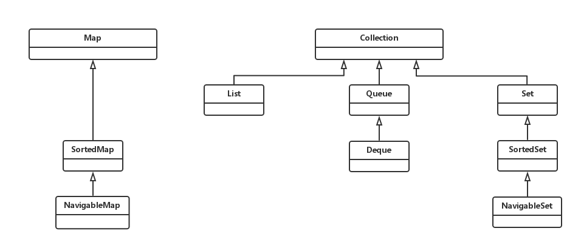

# Java集合框架概述

来源:[yikun.github.io](http://yikun.github.io/2015/03/31/Java%E9%9B%86%E5%90%88%E6%A1%86%E6%9E%B6/)

[Java-Collection-Introduction]:https://docs.oracle.com/javase/tutorial/collections/intro/index.html

## 什么是集合？

这Java官方的[入门文档][Java-Collection-Introduction]是这样描述集合的：

> Collection(有时候也叫container)是一个简单的对象，它把多个元素组织成一个单元。集合可以用来存储、检索、操作、通信。通常情况下，集合代表了一个自然数据项，比如一组手牌(牌的集合)、邮件文件夹(邮件的集合)、电话目录(姓名到电话的映射)。如果你使用过Java或者其他语言，你应该很熟悉集合。

## 什么是集合框架？

Collections Framework是一个用来表示和操作集合的统一的架构。集合的框架包括了：

* **Interfaces:**

这些是表示集合的抽象数据类型，接口允许集合完成操作，独立与其详细的实现。在面向对象的语言中，接口构成了体系架构；

* **Implementations:**

这些是接口的具体实现。本质上，是一些可复用的数据结构；

* **Algorithms:**
这些方法可以对接口实现的对象进行有用的计算，比如搜索、排序。这些算法是具有多态性的：也就是说，同样的方法可以用在合适的接口的不同实现。本质上，是一些可复用的函数。

除了Java的集合框架，还有一些著名的集合框架的例子：比如C++的STL和Smalltalk的集合架构。从历史上来看，集合框架可能比较复杂，也可能有一些很陡峭的学习曲线。不过我们相信Java的集合框架会突破这样的传统，在这章你就可以自己学会。

## 使用集合框架有什么好处？

Java的集合框架提供了一下优点：

* **减少编程的工作量：**通过提供有用的数据结构和算法，集合框架能让你更专注的实现程序的核心功能，而不是去做一个底层的“管道工”。Java框架通过促进无关API的互操作性，使得你不用自己去实现不同API的适配
* **提高程序的速度与质量：**集合框架提供了一些有用数据结构和算法的高性能、高质量的实现。每个接口的不同的实现也是可以互换的，所以程序可以通过切换集合来做一些调整。正因为你从实现数据结构的那些苦差事中脱离出来，你才可以有更多的实现去改善你自己程序的性能和质量
* **允许无关APIs的互操作：**集合接口是API之间传递集合的一个“方言”，比如我的网络管理API有一个节点名的集合，而GUI工具需要一个列标题的集合，即使是分开实现它们，我们的APIs也可以无缝的接合。
* **省力地学习和使用新API：**这是另一个领先的优势，设计者和实现者没必要在每次都重新设计API的时候都“推倒重来”地实现集合，而是直接使用标准的集合接口就好了。
* **促进软件的复用：**符合标准集合接口的新数据结构本质上是可以复用的。对于操作这些新数据结构算法也是一样可以复用的。

因此，后面也便从接口、实现、算法几方面结合着代码和官方的文档学习总结一下。

## 接口



在Java中所有的核心集合接口都是generic的

```
public interface Collection<E> extends Iterable<E> {}
public interface List<E> extends Collection<E> {}
public interface Queue<E> extends Collection<E> {}
public interface Deque<E> extends Queue<E> {}
public interface Set<E> extends Collection<E> {}
public interface SortedSet<E> extends Set<E> {}
public interface NavigableSet<E> extends SortedSet<E> {}
public interface Map<K,V> {}
public interface SortedMap<K,V> extends Map<K,V> {}
public interface NavigableMap<K,V> extends SortedMap<K,V> {}
```

也就是说在声明一个Collection的时候，应该指定一种类型。官方是这样解释原因的：

> Specifying the type allows the compiler to verify (at compile-time) that the type of object you put into the collection is correct, thus reducing errors at runtime.

下面就来介绍一下几种接口：

* **Collection：** 集合层次中的根。一个集合表示一组对象。有些有序，有些无序。有些重复，有些不重复。Collection没有直接的实现，而只有它的子接口的对应的实现。
* **Set：**不能包含重复的元素，比如扑克手牌、学生选课计划、计算机的进程。
* **List：**有序的集合，也可以包含重复的元素。用于对每个元素精确的控制，比如插入、用index来索引。
* **Queue：**用于多元素有优先级的处理，可以用做FIFO
* **Deque：**用于多元素有优先级的处理，double ended queue，可以用作FIFO，LIFO
* **Map：**用于keys到values的映射，不能包含重复元素

另外还提供了2个带排序的Set和Map。

* **SortedSet：**元素升序
* **SortedMap：**key升序

在1.6版本开始，还有两种新的接口**NavigableSet**、**NavigableMap**。

> A SortedMap/SortedSet extended with navigation methods reporting closest matches for given search targets.

提供诸如：

```
// 返回第一个大于e的元素
E higher(E e);
```

之类的“导航性质”的便捷操作。

以上便是Java集合框架与接口的相关内容。