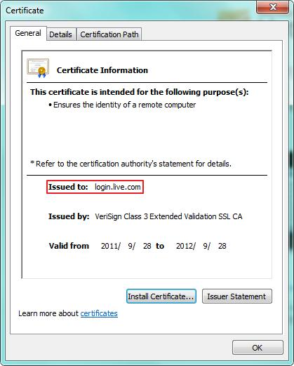
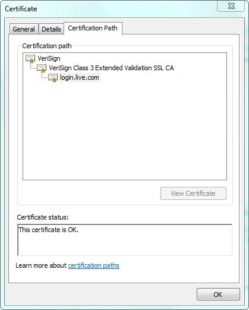
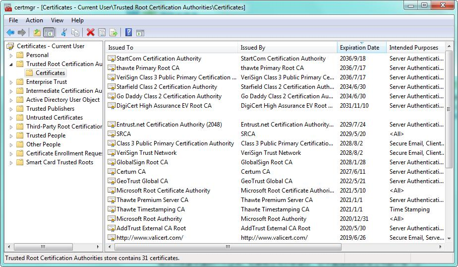
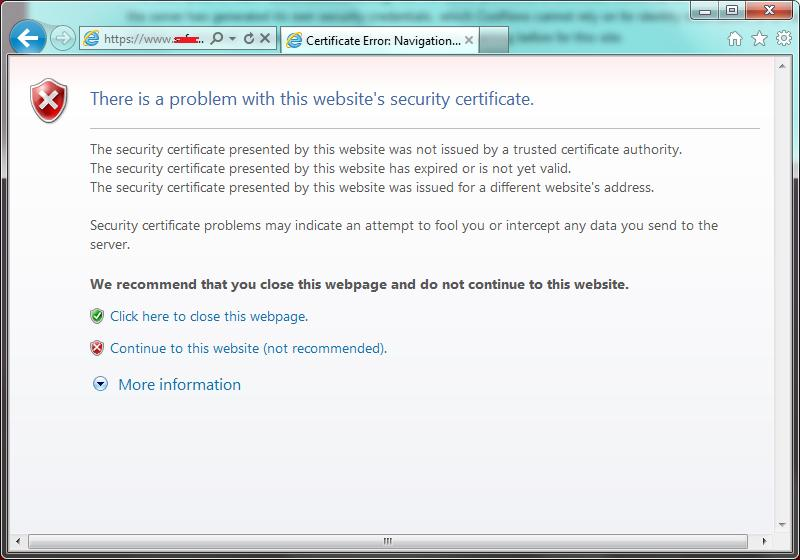
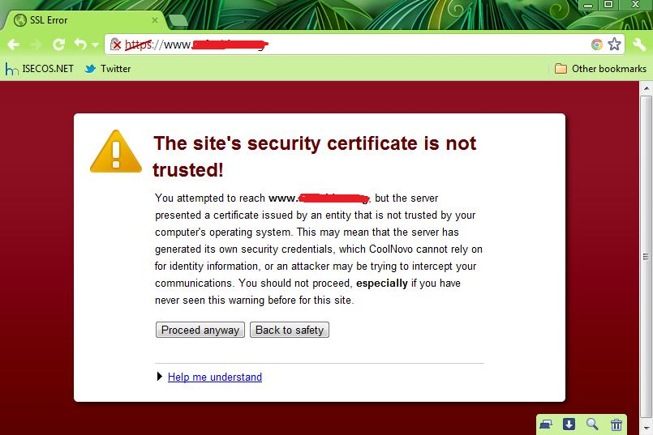

# HTTPS那些事（二）SSL证书 

来源:[果壳网](http://www.guokr.com/post/116169/)

[https-principle]:1.HTTPS原理.md
[X.509]:http://en.wikipedia.org/wiki/X.509
[PKI]:http://en.wikipedia.org/wiki/Public_key_infrastructure
[CA]:http://en.wikipedia.org/wiki/Certificate_authority

从第一部分[HTTPS原理][https-principle]中，我们可以了解到HTTPS核心的一个部分是数据传输之前的握手，握手过程中确定了数据加密的密码。在握手过程中，网站会向浏览器发送SSL证书，SSL证书和我们日常用的身份证类似，是一个支持HTTPS网站的身份证明，SSL证书里面包含了网站的域名，证书有效期，证书的颁发机构以及用于加密传输密码的公钥等信息，由于公钥加密的密码只能被在申请证书时生成的私钥解密，因此浏览器在生成密码之前需要先核对当前访问的域名与证书上绑定的域名是否一致，同时还要对证书的颁发机构进行验证，如果验证失败浏览器会给出证书错误的提示。在这一部分我将对SSL证书的验证过程以及个人用户在访问HTTPS网站时，对SSL证书的使用需要注意哪些安全方面的问题进行描述。

> 小提示：文章比较长，如果你对SSL证书到底是怎么一回事，以及SSL欺骗的原理没有兴趣可以跳过前面的部分，但是希望你能看一下“三、证书的验证过程”中的那些图片，知道浏览器会在什么情况下提示SSL证书错误；再看一下文章结尾处的3条总结，基本上就可以知道如何安全的使用HTTPS了。

## 一、证书的类型
实际上，我们使用的证书分很多种类型，SSL证书只是其中的一种。证书的格式是由[X.509][X.509]标准定义。SSL证书负责传输公钥，是一种[PKI][PKI]（Public Key Infrastructure，公钥基础结构）证书。

我们常见的证书根据用途不同大致有以下几种：

* 1、SSL证书，用于加密HTTP协议，也就是HTTPS。
* 2、代码签名证书，用于签名二进制文件，比如Windows内核驱动，Firefox插件，Java代码签名等等。
* 3、客户端证书，用于加密邮件。
* 4、双因素证书，网银专业版使用的USB Key里面用的就是这种类型的证书。

这些证书都是由受认证的证书颁发机构——我们称之为CA（[Certificate Authority][CA]）机构来颁发，针对企业与个人的不同，可申请的证书的类型也不同，价格也不同。CA机构颁发的证书都是受信任的证书，对于SSL证书来说，如果访问的网站与证书绑定的网站一致就可以通过浏览器的验证而不会提示错误。

## 二、SSL证书申请与规则
SSL证书可以向CA机构通过付费的方式申请，也可以自己制作。

CA机构颁发的证书价格非常昂贵，而且有效期一般只有一年到三年不等（年数不同，价格也不同），过期之后还要再次交钱申请，因此一般只有企业才会申请证书。但是随着个人网站的增多，目前也有针对个人的SSL证书服务，价格相对便宜一些，国内的话400多块钱就能申请到一个，国外更是有免费的SSL证书可以申请。

在申请SSL证书时需要向CA机构提供网站域名，营业执照，以及申请人的身份信息等。网站的域名非常重要，申请人必须证明自己对域名有所有权，如果支持Hotmail.com，Gmail.com的SSL证书都可以随便申请，黑客们就不用做假证书欺骗了。此外，一个证书一般只绑定一个域名，如果CA机构心情好的话，会免费再绑一个，比如你要申请域名时绑定的域名是guokr.com，那么只有在浏览器地址是[https://guokr.com](https://guokr.com)的时候，这个证书才是受信任的，如果地址是[https://www.guokr.com](https://www.guokr.com)或者[https://login.guokr.com](https://login.guokr.com)，那么这个证书由于访问的域名与证书绑定的域名不同，仍然会被浏览器显示为不受信任的。CA机构也提供申请通配符域名（例如，*.guokr.com），通配符域名相当于绑定了主域名下的所有域名，因此使用起来非常方便，但是价格也超级昂贵，一个通配符域名一年大概得5000块钱，只有企业才可以申请。

下面就来看看一个证书的信息：

在访问hotmail的时候会跳转到login.live.com，这时IE浏览器上会有一个小锁头，点一下那个小锁头再点击里面的“查看证书”就会出现上图的证书窗口，这里面我们可以看到这个证书只有一个用途——向远程计算机证明身份信息，证书的用途会有很多，SSL只是其中之一。在“颁发给”这一项就是这个证书在申请时绑定的域名；下面的“颁发者”是证书的颁发机构。最下面的两个日期是证书申请时间以及过期的时间。这里我们可以注意一下“颁发者”的信息，里面有“Extended Validation SSL”的字样，表明了这个证书是一个EV SSL证书（扩展验证SSL证书），EV SSL证书有个特点就是可以让浏览器的地址栏变绿，同时显示出来证书所属公司的名称，如下图所示：

EV SSL证书与其他的证书相比，费用更高。

以上说的是向CA机构申请证书的情况，如果个人网站只为加密传输也可以自己制作SSL证书，自己制作的证书不会受到浏览器的信任，在访问的时候由于证书验证失败而给出警告。

## 三、证书的验证过程

证书以证书链的形式组织，在颁发证书的时候首先要有根CA机构颁发的根证书，再由根CA机构颁发一个中级CA机构的证书，最后由中级CA机构颁发具体的SSL证书。我们可以这样理解，根CA机构就是一个公司，根证书就是他的身份凭证，每个公司由不同的部门来颁发不同用途的证书，这些不同的部门就是中级CA机构，这些中级CA机构使用中级证书作为自己的身份凭证，其中有一个部门是专门颁发SSL证书，当把根证书，中级证书，以及最后申请的SSL证书连在一起就形成了证书链，也称为证书路径。在验证证书的时候，浏览器会调用系统的证书管理器接口对证书路径中的所有证书一级一级的进行验证，只有路径中所有的证书都是受信的，整个验证的结果才是受信。我们还是以login.live.com这个证书举例，在查看证书的时候，点击“证书路径”标签就会有下图的显示：

根证书是最关键的一个证书，如果根证书不受信任，它下面颁发的所有证书都不受信任。操作系统在安装过程中会默认安装一些受信任的CA机构的根证书，可以在“运行”里面运行“certmgr.msc”启动证书管理器，如下图所示：

根证书的有效期长，支持的用途多以方便颁发不同用途类型的中级证书；中级证书用途单一，有效期相对短一些，但是比具体的SSL证书要长很多。

如果SSL证书验证失败根据浏览器的不同会有以下的错误提示：

SSL证书验证失败有以下三点原因：

* 1、SSL证书不是由受信任的CA机构颁发的
* 2、证书过期
* 3、访问的网站域名与证书绑定的域名不一致

这三点原因也是IE浏览器给出的提示。

> 小提示：如果你对哪个根证书CA机构比较憎恨，可以将它的根证书删除，这样所有它颁发的证书都不会受信任。

## 四、SSL证书的安全问题

对HTTPS最常见的攻击手段就是SSL证书欺骗或者叫SSL劫持，是一种典型的中间人攻击。不过SSL劫持并非只是用于攻击目的，在一些特殊情况下利用SSL劫持我们可以更顺畅的访问网络，我会在后文提到。

以攻击为目的的SSL劫持如果不注意浏览器安全提示的话，很容易就中招。当网络中有中间人发起SSL劫持攻击时，攻击者需要伪造一个SSL证书发给浏览器，这个时候由于伪造的SSL证书不受信任，浏览器会给出提示。

这里有一个误区，当SSL证书不受信任的时候，并不一定就是有SSL劫持发生，有种例外情况是：一些个人网站买不起合法的SSL证书，因此会自己制作一个SSL证书来加密传输的数据。如果你经常访问某个个人网站，而且你知道这个网站是干什么的，那么这种情况可以不用担心。但是如果你访问的是网银，在线支付，或者是hotmail.com，gmail.com等，这类公司性质的网站一定会申请合法的SSL证书（12306.cn除外），一旦SSL证书不受信任，应该果断的终止访问，这个时候网络中一定会存在异常行为，对于一些小区宽带的用户一定要注意这点。

所以作为个人用户，你一定要知道你访问的是什么网站，如果你只是一个没有多少计算机只是的普通网民，我相信你不会经常上那些自己制作SSL证书的个人网站（12306.cn除外），因此如果你没有办法判断网络是不是有异常，只要是证书有问题的，干脆就别再访问了。

> 小提示：对于12306.cn，一定要按照网站说的那样，“为保障您顺畅购票，请下载安装根证书”。

最后我们总结一下使用SSL证书要注意的问题：

* 1、除非必要，不要随意安装根证书。安装根证书的时候一定要明确证书的来源。
* 2、对于网银，在线支付，重要邮箱等网站，一定要确保SSL证书是没有问题的，如果浏览器给出SSL证书错误的警告，一定要拒绝访问。一些小区宽带用户一定要注意这点。
* 3、由于现在个人申请SSL证书比较便宜，一定要注意挂着合法SSL证书的钓鱼网站（国外比较常见）。对于钓鱼网站，一定要看清域名，另外别相信什么中奖的消息，同时要安装带有钓鱼防护功能的安全软件。