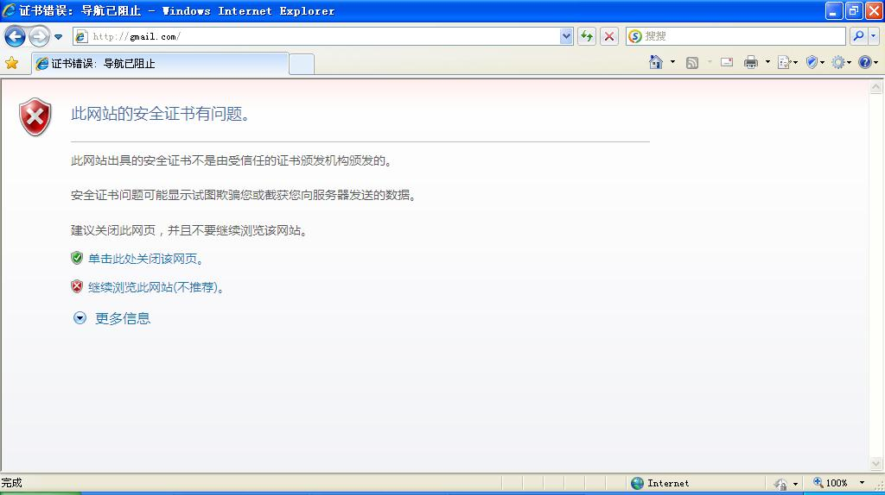
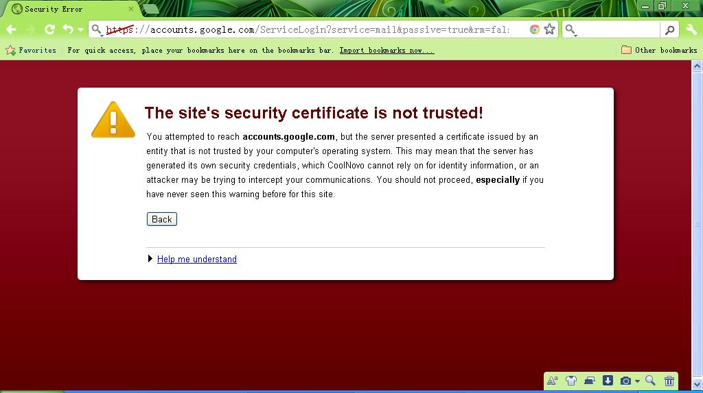
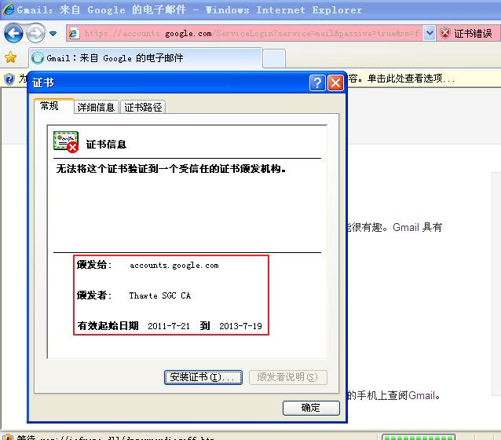
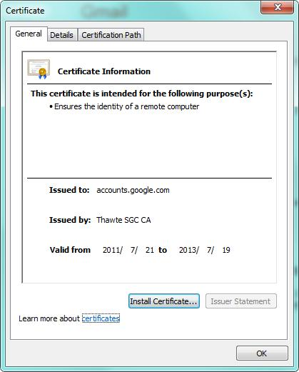

# HTTPS那些事（三）攻击实例与防御 

来源:[果壳网](http://www.guokr.com/post/148613/)

[https-ssl-cert]:2.SSL证书.md

在[《HTTPS那些事（二）SSL证书》][https-ssl-cert]我描述了使用SSL证书时一些需要注意的安全问题，在这一篇文章里面我再演示一下针对HTTPS攻击的一些实例，通过这些实例能更安全的使用HTTPS。知己知彼百战不殆。

先说一下我的测试环境，WIFI局域网，两台计算机，其中一台是Windows 7用于发起攻击。另一台测试机用于测试攻击，配置为Windows XP SP3，IE8，Chrome 17。

在开始之前，再回顾一下SSL证书验证失败的三点原因：

* SSL证书不是由受信任的CA机构颁发的
* 证书过期
* 访问的网站域名与证书绑定的域名不一致

## 一、SSL劫持攻击
SSL劫持也就是SSL证书欺骗攻击，攻击者为了获得HTTPS传输的明文数据，需要先将自己接入到浏览器与目标网站之间（中间人），在传输数据的过程中，替换目标网站发给浏览器的证书，之后解密传输中的数据，简单的图示如下：

[浏览器] <======> [目标网站] （正常情况）
[浏览器] <======> 中间人 <======> [目标网站] （中间人攻击）

中间人攻击最好的环境是在局域网中，局域网中所有的计算机需要通过一个固定的出口（网关）来接入互联网，因此攻击者只需要在局域网中实施一次中间人攻击就可以顺利的截获所有计算机与网关之间传输的数据。

下图就是在我的测试环境中实施一次中间人攻击之后进行的SSL证书欺骗工具，可以看到此时被欺骗的机器，浏览器已经给出证书错误的安全提示：

看到这样的提示，正常情况应该停止访问，如果继续访问，所有加密传输的数据都可以被攻击者解密。在这里我选择继续访问来看一下伪造的SSL证书信息。

这里可以看到，假证书中“颁发给”，“颁发者”，“有效日期”与真证书一样（见下图），攻击者可以在生成证书的时候给假证书写入与原始证书一样的信息来迷惑用户，但是迷惑不了证书的验证机制。对于普通用户来说，一定要看清浏览器的警告信息，如果有问题，就不要再继续访问。

## 二、SSLStrip攻击
SSLStrip攻击也需要将攻击者设置为中间人，之后将HTTPS访问替换为HTTP返回给浏览器，由于HTTP协议传输的数据是未加密的，从而截获用户访问的数据。举个例子，当我们访问hotmail.com的时候会重定向到一个[https://login.live.com](https://login.live.com)的一个HTTPS的地址上，SSLStrip会代替用户与服务器通信，并将这个地址改为[http://login.live.com](http://login.live.com)（注意这个地址在http后面**没有s**）返回给浏览器，此时如果用户继续登录的话，攻击者就会截取到用户的密码。这种攻击非常对普通用户非常具有迷惑性，但是防御却非常的简单：

* 对于网站来说，在配置HTTPS服务的时候加上[“HTTP Strict Transport Security”](http://en.wikipedia.org/wiki/Strict_Transport_Security)配置项；或者是在代码中将所有HTTP的请求强制转移到HTTPS上，使用URL REWRITE也可以达到同样的效果。
* 对于关键的信息，例如用户登录网站的ID和密码，在发送之前先用JavaScript进行一次加密处理，这种方法不但是对SSLStrip有效，对SSL劫持攻击也有效，甚至是即便使用HTTP协议来传输用户登录的ID和密码都是安全的。这个功能果壳网就支持。
* 对于用户来说，在访问那些支持HTTPS的网站的时候，在浏览器的地址栏输入URL时强制的加上“https://”，大多数用户平时不注意这点，比如访问gmail，我们一般就输入“gmail.com”，如果是输入“[https://gmail.com](https://gmail.com)”就可以避免SSLStrip的攻击。对于使用脚本实现地址跳转也需要注意这个问题，location.href之后的URL，一定要强制加上“https://”。

由于防御SSLStrip攻击比较简单，大多数的网站都已经做好了安全方面的配置，但也有少数的网站仍然没有重视这个问题。

## 三、第三类攻击

所谓第三类攻击，完全就是软件厂商在软件的设计过程中忽略的了安全的问题，比如说前段时间某个手机浏览器就干了这么一件糗事。实际上这也是一种普遍存在的情况，程序的bug、漏洞，设计缺陷，都会打破一些安全模型。对于这种情况，软件厂商在软件设计阶段要充分考虑安全的问题，并且及时更新程序中的缺陷与安全漏洞；作为用户要及时的更新应用程序或者系统补丁，从而减少安全威胁。

目前最为常见的手段仍然是SSL劫持攻击，但无论是什么攻击手段，基础的利用都是局域网的中间人攻击，这种攻击手段非常的实用，尤其是在公共网络中。针对SSL的中间人攻击对普通用户来说或许还好识别一些，但是我们大多数情况访问的都是HTTP网站，传输的数据都是明文的，在这种情况下中间人攻击是不容易被发现的。对于普通用户，可以用以下的办法来防御局域网中间人攻击：

* 公司办公网络一定要在交换机上进行MAC地址绑定，对于一些规模不大，暂时不考虑加固内网的公司可以采取下面我说的方法。
* 临时接入公共网络的计算机，可以临时开启安全软件内的ARP防火墙。或者是使用VPN。
* 对于一些不喜欢安装安全软件的用户，可以使用stunnel配置代理或者是使用SSH转SOCKS 5代理。但是这需要用户有独立的服务器。
* 使用GoAgent代理工具，GoAgent与stunnel类似，都是一种使用ssl tunnel对传输进行加密的工具。即便是访问HTTP网站，GoAgent也可以像stunnel那样对传输进行加密，可以保证浏览网页，访问WEB邮箱的安全。GoAgent使用的是Google App Engine服务器，因此访问国内网站的速度会比较慢，对于这种情况可以使用Sina App Engine，具体配置方法可以在搜索引擎中用“goagent sae”作为关键字进行搜索。
* 在公共网络如果要进行商务办公，最好是用公司提供的VPN来对传输进行加密。

最后再说说手机上网，目前公共WIFI越来越普及，手机上网也越来越方便，因此也需要重视数据传输过程中的安全问题。虽然GoAgent也有支持Android和iOS的版本，但如果要使用在线支付之类的功能，最好是利用官方出的应用来进行操作。针对手机的安全防护目前还没有计算机那么强大，因此在没有办法保证传输加密数据之前，最好不要用手机来做什么涉及到隐私或者是商业保密的工作。

