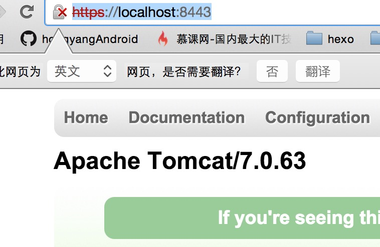

# Android Https相关完全解析 当OkHttp遇到Https

来源:[CSDN](http://blog.csdn.net/lmj623565791/article/details/48129405)

## 一、概述

其实这篇文章理论上不限于okhttp去访问自签名的网站，不过接上篇博文了，就叫这个了。首先要了解的事，okhttp默认情况下是支持https协议的网站的，比如`https://www.baidu.com`，`https://github.com/hongyangAndroid/okhttp-utils`等，你可以直接通过okhttp请求试试。不过要注意的是，支持的https的网站基本都是CA机构颁发的证书，默认情况下是可以信任的。

当然我们今天要说的是自签名的网站，什么叫自签名呢？就是自己通过`keytool`去生成一个证书，然后使用，并不是CA机构去颁发的。使用自签名证书的网站，大家在使用浏览器访问的时候，一般都是报风险警告，好在有个大名鼎鼎的网站就是这么干的，`https://kyfw.12306.cn/otn/`，点击进入12306的购票页面就能看到了。

如下界面：


大家可以尝试拿okhttp访问下:

```
OkHttpClientManager.getAsyn("https://kyfw.12306.cn/otn/", callack);
```

会爆出如下错误:

```
javax.net.ssl.SSLHandshakeException: 
    java.security.cert.CertPathValidatorException: 
        Trust anchor for certification path not found.
```

好了，本篇博文当然不是去说如何去访问12306，而是以12306为例子来说明如何去访问自签名证书的网站。因为部分开发者app与自己服务端交互的时候可能也会遇到自签名证书的。甚至在开发安全级别很高的app时，需要用到双向证书的验证。

那么本篇博文的基本内容包含：

* https一些相关的知识
* okhttp访问自签名https网站
* 如何构建一个支持https的服务器（这里主要为了测试多个证书的时候，如何去加载）
* 如何进行双向证书验证

## 二、Https相关知识

关于特别理论的东西大家可以百度下自己去了解下，这里就简单说一下，HTTPS相当于HTTP的安全版本了，为什么安全呢？

因为它在HTTP的之下加入了SSL (Secure Socket Layer)，安全的基础就靠这个SSL了。SSL位于TCP/IP和HTTP协议之间，那么它到底能干嘛呢？

它能够：

* 认证用户和服务器，确保数据发送到正确的客户机和服务器；(验证证书)
* 加密数据以防止数据中途被窃取；（加密）
* 维护数据的完整性，确保数据在传输过程中不被改变。（摘要算法）

> 以上3条来自百度

下面我们简单描述下HTTPS的工作原理，大家就能对应的看到上面3条作用的身影了：

HTTPS在传输数据之前需要客户端（浏览器）与服务端（网站）之间进行一次握手，在握手过程中将确立双方加密传输数据的密码信息。握手过程的简单描述如下：

* 浏览器将自己支持的一套加密算法、HASH算法发送给网站。
* 网站从中选出一组加密算法与HASH算法，并将自己的身份信息以证书的形式发回给浏览器。证书里面包含了网站地址，加密公钥，以及证书的颁发机构等信息。
* 浏览器获得网站证书之后，开始验证证书的合法性，如果证书信任，则生成一串随机数字作为通讯过程中对称加密的秘钥。然后取出证书中的公钥，将这串数字以及HASH的结果进行加密，然后发给网站。
* 网站接收浏览器发来的数据之后，通过私钥进行解密，然后HASH校验，如果一致，则使用浏览器发来的数字串使加密一段握手消息发给浏览器。
* 浏览器解密，并HASH校验，没有问题，则握手结束。接下来的传输过程将由之前浏览器生成的随机密码并利用对称加密算法进行加密。

握手过程中如果有任何错误，都会使加密连接断开，从而阻止了隐私信息的传输。

> ok，以上的流程不一定完全正确，基本就是这样，当然如果有明显错误欢迎指出。

根据上面的流程，我们可以看到服务器端会有一个证书，在交互过程中客户端需要去验证证书的合法性，对于权威机构颁发的证书当然我们会直接认为合法。对于自己造的证书，那么我们就需要去校验合法性了，也就是说我们只需要让OkhttpClient去信任这个证书就可以畅通的进行通信了。

当然，对于自签名的网站的访问，网上的部分的做法是直接设置信任所有的证书，对于这种做法肯定是有风险的，所以这里我们不去介绍了，有需要自己去查。

下面我们去考虑，如何让OkHttpClient去信任我们的证书，接下里的例子就是靠12306这个福利站点了。

首先导出12306的证书，这里12306提供了下载地址：[12306证书点击下载](https://kyfw.12306.cn/otn/)

下载完成，解压拿到里面的`srca.cer`，一会需要使用。ps:即使没有提供下载，也可以通过浏览器导出的，自行百度。

## 三、代码

### （一）、访问自签名的网站

首先把我们下载的`srca.cer`放到`assets`文件夹下，其实你可以随便放哪，反正能读取到就行。

然后在我们的`OkHttpClientManager`里面添加如下的方法：

```
public void setCertificates(InputStream... certificates){
    try{
        CertificateFactory certificateFactory = CertificateFactory.getInstance("X.509");
        KeyStore keyStore = KeyStore.getInstance(KeyStore.getDefaultType());
        keyStore.load(null);
        int index = 0;
        for (InputStream certificate : certificates){
            String certificateAlias = Integer.toString(index++);
            keyStore.setCertificateEntry(certificateAlias, certificateFactory.generateCertificate(certificate));

            try{
                if (certificate != null)
                    certificate.close();
            } catch (IOException e){
            }
        }

        SSLContext sslContext = SSLContext.getInstance("TLS");

        TrustManagerFactory trustManagerFactory = 
            TrustManagerFactory.getInstance(TrustManagerFactory.getDefaultAlgorithm()); 

        trustManagerFactory.init(keyStore);
        sslContext.init(   
                null, 
                trustManagerFactory.getTrustManagers(), 
                new SecureRandom()
            );
       mOkHttpClient.setSslSocketFactory(sslContext.getSocketFactory());


    } catch (Exception e){
        e.printStackTrace();
    } 

}
```

为了代码可读性，我把异常捕获的部分简化了，可以看到我们提供了一个方法传入InputStream流，InputStream就对应于我们证书的输入流。

代码内部，我们：

* 构造CertificateFactory对象，通过它的generateCertificate(is)方法得到Certificate。
* 然后讲得到的Certificate放入到keyStore中。
* 接下来利用keyStore去初始化我们的TrustManagerFactory
* 由trustManagerFactory.getTrustManagers获得TrustManager[]初始化我们的SSLContext
* 最后，设置我们mOkHttpClient.setSslSocketFactory即可。

这样就完成了我们代码的编写，其实挺短的，当客户端进行SSL连接时，就可以根据我们设置的证书去决定是否新人服务端的证书。

记得在Application中进行初始化：

```
public class MyApplication extends Application{
    @Override
    public void onCreate(){
        super.onCreate();
        try{
            OkHttpClientManager.getInstance()
                    .setCertificates(getAssets().open("srca.cer"));
        } catch (IOException e){
            e.printStackTrace();
        }
    }
}
```

然后尝试以下代码访问12306的网站：

```
OkHttpClientManager.getAsyn("https://kyfw.12306.cn/otn/", new OkHttpClientManager.ResultCallback<String>(){
    @Override
    public void onError(Request request, Exception e){
        e.printStackTrace();
    }

    @Override
    public void onResponse(String u){
        mTv.setText(u);
    }
});
```

这样即可访问成功。完整代码已经更新至：[https://github.com/hongyangAndroid/okhttp-utils](https://github.com/hongyangAndroid/okhttp-utils)，可以下载里面的sample进行测试，里面包含12306的证书。

ok，到这就可以看到使用Okhttp可以很方便的应对自签名的网站的访问，只需要拿到包含公钥的证书即可。

### （二）、使用字符串替代证书

下面继续，有些人可能觉得把证书copy到assets下还是觉得不舒服，其实我们还可以将证书中的内容提取出来，写成字符串常量，这样就不需要证书根据着app去打包了。

```
zhydeMacBook-Pro:temp zhy$ keytool -printcert -rfc -file srca.cer
-----BEGIN CERTIFICATE-----
MIICmjCCAgOgAwIBAgIIbyZr5/jKH6QwDQYJKoZIhvcNAQEFBQAwRzELMAkGA1UEBhMCQ04xKTAn
BgNVBAoTIFNpbm9yYWlsIENlcnRpZmljYXRpb24gQXV0aG9yaXR5MQ0wCwYDVQQDEwRTUkNBMB4X
DTA5MDUyNTA2NTYwMFoXDTI5MDUyMDA2NTYwMFowRzELMAkGA1UEBhMCQ04xKTAnBgNVBAoTIFNp
bm9yYWlsIENlcnRpZmljYXRpb24gQXV0aG9yaXR5MQ0wCwYDVQQDEwRTUkNBMIGfMA0GCSqGSIb3
DQEBAQUAA4GNADCBiQKBgQDMpbNeb34p0GvLkZ6t72/OOba4mX2K/eZRWFfnuk8e5jKDH+9BgCb2
9bSotqPqTbxXWPxIOz8EjyUO3bfR5pQ8ovNTOlks2rS5BdMhoi4sUjCKi5ELiqtyww/XgY5iFqv6
D4Pw9QvOUcdRVSbPWo1DwMmH75It6pk/rARIFHEjWwIDAQABo4GOMIGLMB8GA1UdIwQYMBaAFHle
tne34lKDQ+3HUYhMY4UsAENYMAwGA1UdEwQFMAMBAf8wLgYDVR0fBCcwJTAjoCGgH4YdaHR0cDov
LzE5Mi4xNjguOS4xNDkvY3JsMS5jcmwwCwYDVR0PBAQDAgH+MB0GA1UdDgQWBBR5XrZ3t+JSg0Pt
x1GITGOFLABDWDANBgkqhkiG9w0BAQUFAAOBgQDGrAm2U/of1LbOnG2bnnQtgcVaBXiVJF8LKPaV
23XQ96HU8xfgSZMJS6U00WHAI7zp0q208RSUft9wDq9ee///VOhzR6Tebg9QfyPSohkBrhXQenvQ
og555S+C3eJAAVeNCTeMS3N/M5hzBRJAoffn3qoYdAO1Q8bTguOi+2849A==
-----END CERTIFICATE-----
```

使用·keytool·命令，以rfc样式输出。keytool命令是JDK里面自带的。

有了这个字符串以后，我们就不需要srca.cer这个文件了，直接编写以下代码：

```
public class MyApplication extends Application{

    private String CER_12306 = "-----BEGIN CERTIFICATE-----\n" +
            "MIICmjCCAgOgAwIBAgIIbyZr5/jKH6QwDQYJKoZIhvcNAQEFBQAwRzELMAkGA1UEBhMCQ04xKTAn\n" +
            "BgNVBAoTIFNpbm9yYWlsIENlcnRpZmljYXRpb24gQXV0aG9yaXR5MQ0wCwYDVQQDEwRTUkNBMB4X\n" +
            "DTA5MDUyNTA2NTYwMFoXDTI5MDUyMDA2NTYwMFowRzELMAkGA1UEBhMCQ04xKTAnBgNVBAoTIFNp\n" +
            "bm9yYWlsIENlcnRpZmljYXRpb24gQXV0aG9yaXR5MQ0wCwYDVQQDEwRTUkNBMIGfMA0GCSqGSIb3\n" +
            "DQEBAQUAA4GNADCBiQKBgQDMpbNeb34p0GvLkZ6t72/OOba4mX2K/eZRWFfnuk8e5jKDH+9BgCb2\n" +
            "9bSotqPqTbxXWPxIOz8EjyUO3bfR5pQ8ovNTOlks2rS5BdMhoi4sUjCKi5ELiqtyww/XgY5iFqv6\n" +
            "D4Pw9QvOUcdRVSbPWo1DwMmH75It6pk/rARIFHEjWwIDAQABo4GOMIGLMB8GA1UdIwQYMBaAFHle\n" +
            "tne34lKDQ+3HUYhMY4UsAENYMAwGA1UdEwQFMAMBAf8wLgYDVR0fBCcwJTAjoCGgH4YdaHR0cDov\n" +
            "LzE5Mi4xNjguOS4xNDkvY3JsMS5jcmwwCwYDVR0PBAQDAgH+MB0GA1UdDgQWBBR5XrZ3t+JSg0Pt\n" +
            "x1GITGOFLABDWDANBgkqhkiG9w0BAQUFAAOBgQDGrAm2U/of1LbOnG2bnnQtgcVaBXiVJF8LKPaV\n" +
            "23XQ96HU8xfgSZMJS6U00WHAI7zp0q208RSUft9wDq9ee///VOhzR6Tebg9QfyPSohkBrhXQenvQ\n" +
            "og555S+C3eJAAVeNCTeMS3N/M5hzBRJAoffn3qoYdAO1Q8bTguOi+2849A==\n" +
            "-----END CERTIFICATE-----";

    @Override
    public void onCreate(){
        super.onCreate();

        OkHttpClientManager.getInstance()
                .setCertificates(new Buffer()
                        .writeUtf8(CER_12306)
                        .inputStream());
}
```

注意Buffer是okio包下的，okhttp依赖okio。

ok，这样就省去将cer文件一起打包进入apk了。

接下来介绍，如何去生成证书以及在tomcat服务器下使用自签名证书部署服务。如果大家没这方面需要可以简单了解下。

## 四、tomcat下使用自签名证书部署服务

首先自行下载个tomcat的压缩包。

既然我们要支持https，那么肯定需要个证书，如何生成证书呢？使用keytool非常简单。

### （一）生成证书

```
zhydeMacBook-Pro:temp zhy$ keytool -genkey -alias zhy_server -keyalg RSA -keystore zhy_server.jks -validity 3600 -storepass 123456
您的名字与姓氏是什么?
  [Unknown]:  zhang
您的组织单位名称是什么?
  [Unknown]:  zhang
您的组织名称是什么?
  [Unknown]:  zhang
您所在的城市或区域名称是什么?
  [Unknown]:  xian
您所在的省/市/自治区名称是什么?
  [Unknown]:  shanxi
该单位的双字母国家/地区代码是什么?
  [Unknown]:  cn
CN=zhang, OU=zhang, O=zhang, L=xian, ST=shanxi, C=cn是否正确?
  [否]:  y

输入 <zhy_server> 的密钥口令
    (如果和密钥库口令相同, 按回车): 
```

使用以上命令即可生成一个证书请求文件zhy_server.jks，注意密钥库口令为：123456.

接下来利用zhy_server.jks来签发证书：

```
zhydeMacBook-Pro:temp zhy$ keytool -export -alias zhy_server 
 -file zhy_server.cer 
 -keystore zhy_server.jks 
 -storepass 123456 
```

即可生成包含公钥的证书zhy_server.cer。

(二)、配置Tomcat

找到`tomcat/conf/sever.xml`文件，并以文本形式打开。

在Service标签中，加入：

```
<Connector SSLEnabled="true" acceptCount="100" clientAuth="false" 
    disableUploadTimeout="true" enableLookups="true" keystoreFile="" keystorePass="123456" maxSpareThreads="75" 
    maxThreads="200" minSpareThreads="5" port="8443" 
    protocol="org.apache.coyote.http11.Http11NioProtocol" scheme="https" 
    secure="true" sslProtocol="TLS"
      /> 
```

注意`keystoreFile`的值为我们刚才生成的jks文件的路径：`/Users/zhy/temp/zhy_server.jks`(填写你的路径).`keystorePass`值为密钥库密码:`123456`。

然后启动即可，对于命令行启动，依赖环境变量`JAVA_HOME`；如果在MyEclispe等IDE下启动就比较随意了。

启动成功以后，打开浏览器输入url:`https://localhost:8443/`即可看到证书不可信任的警告了。选择打死也要进入，即可进入tomcat默认的主页：



如果你在此tomcat中部署了项目，即可按照如下url方式访问： 
`https://192.168.1.103:8443/`项目名/path，没有部署也没关系，直接拿默认的主页进行测试了，拿它的html字符串。

对于访问，还需要说么，我们刚才已经生成了`zhy_server.cer`证书。你可以选择copy到assets，或者通过命令拿到内部包含的字符串。我们这里选择copy。

依然选择在Application中设置信任证书：

```
public class MyApplication extends Application{
    private String CER_12306 = "省略...";

    @Override
    public void onCreate(){
        super.onCreate();

        try
        {
            OkHttpClientManager.getInstance().setCertificates(
                    new Buffer()
                    .writeUtf8(CER_12306).inputStream(),
                     getAssets().open("zhy_server.cer")
                    );
        } catch (IOException e){
            e.printStackTrace();
        }

    }
}
```

ok，这样就能正常访问你部署的https项目中的服务了，没有部署项目的尝试拿`https://服务端ip:8443/`测试即可。

> 注意：不要使用localhost，真机测试保证手机和服务器在同一局域网段内。

ok，到此我们介绍完了如果搭建https服务和如何访问，基本上可以应付极大部分的需求了。当然还是极少数的应用需要双向证书验证，比如银行、金融类app，我们一起来了解下。

## 五、双向证书验证

首先对于双向证书验证，也就是说，客户端也会有个“kjs文件”，服务器那边会同时有个“cer文件”与之对应。

我们已经生成了`zhy_server.kjs`和`zhy_server.cer`文件。

接下来按照生成证书的方式，再生成一对这样的文件，我们命名为:`zhy_client.kjs`,`zhy_client.cer`.

### （一）配置服务端

首先我们配置服务端：

服务端的配置比较简单，依然是刚才的Connector标签，不过需要添加些属性。

```
 <Connector  其他属性与前面一致  
    clientAuth="true"
    truststoreFile="/Users/zhy/temp/zhy_client.cer" 
      /> 
```

将`clientAuth`设置为`true`，并且多添加一个属性`truststoreFile`，理论上值为我们的cer文件。这么加入以后，尝试启动服务器，会发生错误：`Invalid keystore format`。说keystore的格式不合法。

我们需要对`zhy_client.cer`执行以下步骤，将证书添加到kjs文件中。

```
keytool -import -alias zhy_client 
    -file zhy_client.cer -keystore zhy_client_for_sever.jks
```

接下里修改server.xml为：

```
 <Connector  其他属性与前面一致 
    clientAuth="true"
    truststoreFile="/Users/zhy/temp/zhy_client_for_sever.jks" 
      /> 
```

此时启动即可。

此时再拿浏览器已经无法访问到我们的服务了，会显示基于证书的身份验证失败。

我们将目标来到客户端，即我们的Android端，我们的Android端，如何设置kjs文件呢。

### （二）配置app端

目前我们app端依靠的应该是`zhy_client.kjs`。

ok，大家还记得，我们在支持https的时候调用了这么俩行代码：

```
sslContext.init(null, trustManagerFactory.getTrustManagers(), 
    new SecureRandom());
mOkHttpClient.setSslSocketFactory(sslContext.getSocketFactory());
```

注意`sslContext.init`的第一个参数我们传入的是null，第一个参数的类型实际上是`KeyManager[] km`,主要就用于管理我们客户端的key。

于是代码可以这么写：

```
public void setCertificates(InputStream... certificates){
    try
    {
        CertificateFactory certificateFactory = CertificateFactory.getInstance("X.509");
        KeyStore keyStore = KeyStore.getInstance(KeyStore.getDefaultType());
        keyStore.load(null);
        int index = 0;
        for (InputStream certificate : certificates){
            String certificateAlias = Integer.toString(index++);
            keyStore.setCertificateEntry(certificateAlias, certificateFactory.generateCertificate(certificate));

            try{
                if (certificate != null)
                    certificate.close();
            } catch (IOException e){
            }
        }

        SSLContext sslContext = SSLContext.getInstance("TLS");
        TrustManagerFactory trustManagerFactory = TrustManagerFactory.
                getInstance(TrustManagerFactory.getDefaultAlgorithm());
        trustManagerFactory.init(keyStore);

        //初始化keystore
        KeyStore clientKeyStore = KeyStore.getInstance(KeyStore.getDefaultType());
        clientKeyStore.load(mContext.getAssets().open("zhy_client.jks"), "123456".toCharArray());

        KeyManagerFactory keyManagerFactory = KeyManagerFactory.getInstance(KeyManagerFactory.getDefaultAlgorithm());
        keyManagerFactory.init(clientKeyStore, "123456".toCharArray());

        sslContext.init(keyManagerFactory.getKeyManagers(), trustManagerFactory.getTrustManagers(), new SecureRandom());
        mOkHttpClient.setSslSocketFactory(sslContext.getSocketFactory());


    } catch (Exception e){
        e.printStackTrace();
    } 
}
```

核心代码其实就是：

```
//初始化keystore
KeyStore clientKeyStore = KeyStore.getInstance(KeyStore.getDefaultType());
clientKeyStore.load(mContext.getAssets().open("zhy_client.jks"), "123456".toCharArray());

KeyManagerFactory keyManagerFactory = KeyManagerFactory.getInstance(KeyManagerFactory.getDefaultAlgorithm());
keyManagerFactory.init(clientKeyStore, "123456".toCharArray());

sslContext.init(keyManagerFactory.getKeyManagers(), trustManagerFactory.getTrustManagers(), new SecureRandom());
```

然而此时启动会报错：`java.io.IOException: Wrong version of key store`.

为什么呢？

因为：Java平台默认识别jks格式的证书文件，但是android平台只识别bks格式的证书文件。

这么就纠结了，我们需要将我们的jks文件转化为bks文件，怎么转化呢？

这里的方式可能比较多，大家可以百度，我推荐一种方式：

去[Portecle](http://sourceforge.net/projects/portecle/files/)下载[Download portecle-1.9.zip (3.4 MB)](http://sourceforge.net/projects/portecle/files/latest/download?source=files)。

解压后，里面包含`bcprov.jar`文件，使用`jave -jar bcprov.jar`即可打开GUI界面。


按照上图即可将`zhy_client.jks`转化为`zhy_client.bks`。

然后将`zhy_client.bks`拷贝到`assets`目录下，修改代码为：

```
//初始化keystore
KeyStore clientKeyStore = KeyStore.getInstance("BKS");
clientKeyStore.load(mContext.getAssets().open("zhy_client.bks"), "123456".toCharArray());

KeyManagerFactory keyManagerFactory = KeyManagerFactory.getInstance(KeyManagerFactory.getDefaultAlgorithm());
keyManagerFactory.init(clientKeyStore, "123456".toCharArray());

sslContext.init(keyManagerFactory.getKeyManagers(), trustManagerFactory.getTrustManagers(), new SecureRandom());
```

再次运行即可。然后就成功的做到了双向的验证，关于双向这块大家了解下即可。

源码都在[https://github.com/hongyangAndroid/okhttp-utils](https://github.com/hongyangAndroid/okhttp-utils)之中。

ok，到此本篇博文就结束了，文章相当的长~~ 关于okhttp在https协议下的使用，应该没什么问题。

ps：如果大家对okhttp-utils有任何建议，非常欢迎提出，最近根据大家的需求修改相当频繁~~


参考:

* [http://blog.csdn.net/hfeng101/article/details/10163627](http://blog.csdn.net/hfeng101/article/details/10163627)
* [http://www.ibm.com/developerworks/cn/java/j-lo-socketkeytool/index.html?ca=drs](http://www.ibm.com/developerworks/cn/java/j-lo-socketkeytool/index.html?ca=drs)
* [http://sourceforge.net/projects/portecle/files/](http://sourceforge.net/projects/portecle/files/)
* [http://blog.sina.com.cn/s/blog_7035c6ac01017hrx.html](http://blog.sina.com.cn/s/blog_7035c6ac01017hrx.html)
* [http://blog.csdn.net/cuker919/article/details/7599969](http://blog.csdn.net/cuker919/article/details/7599969)
* [http://www.cnblogs.com/devinzhang/archive/2012/02/28/2371631.html](http://www.cnblogs.com/devinzhang/archive/2012/02/28/2371631.html)
* [http://baike.baidu.com/link?url=eIodqEk7ATgau_jo74PvQdgqb_L6cajJWT9e7SzQrKfAomVY_05KB_dKyZYf-kbjupt_u9Bi0rn8l9wmnQobTa](http://baike.baidu.com/link?url=eIodqEk7ATgau_jo74PvQdgqb_L6cajJWT9e7SzQrKfAomVY_05KB_dKyZYf-kbjupt_u9Bi0rn8l9wmnQobTa)
* [https://github.com/square/okhttp/blob/master/samples/guide/src/main/java/com/squareup/okhttp/recipes/CustomTrust.java](https://github.com/square/okhttp/blob/master/samples/guide/src/main/java/com/squareup/okhttp/recipes/CustomTrust.java)
* [http://blog.csdn.net/raptor/article/details/18896375](http://blog.csdn.net/raptor/article/details/18896375)
* [http://blog.csdn.net/raptor/article/details/18898937](http://blog.csdn.net/raptor/article/details/18898937)
* [http://nelenkov.blogspot.com/2011/12/using-custom-certificate-trust-store-on.html](http://nelenkov.blogspot.com/2011/12/using-custom-certificate-trust-store-on.html)


--------

评论

* 评论1

**问题:**请教一下我配置好了之后提示
onError : Hostname 192.168.0.163 not verified:
这样的错误是什么原因啊？
请大神指教一下......

**回答1：**问题解决了，借此宝地，告诉大家，免得走弯路。问题出在用域名还是IP来访问服务器，如果用IP是有特别要求的:
keytool -genkey -dname "CN=192.168.1.103,OU=soft,O=xab,L=FengTai,ST=Beijing,c=cn" -validity 10000 -storepass 123456 -keypass 123456 -ext san=ip:192.168.1.103

关键是：-ext san=ip:192.168.1.103 ，需要jdk1.7。
下面参考依据：
The HTTPS specification (RFC 2818) is quite clear about the server identity verification with an IP address: a Subject Alternative Name (IP) entry must be present in the certificate (whereas the CN in the Subject DN would suffice as a fallback solution for a host name).

**回答2：**回复sinat_24526821：简直不要太感谢啊，道友。我昨晚也碰到了这个问题hostname ***.**... not verified 
今天也在stack overflow看到了个类似的解决 http://stackoverflow.com/questions/30745342/javax-net-ssl-sslpeerunverifiedexception-hostname-not-verified
然后翻看评论原来真有同样问题的哈。握个手。

总结一下，就是在hongyang大哥的基础上，后面加上 -ext san=ip:192.168.56.1（后面的ip是你电脑的ip地址哈）
比如第一次生成jks就是这样：keytool -genkey -alias boy_server -keyalg RSA -keystore boy_server.jks -validity 3600 -storepass 123456 -ext san=ip:192.168.56.1

