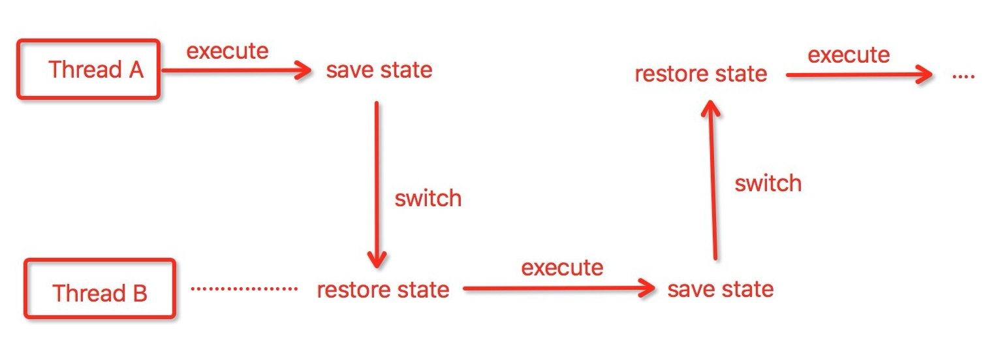

# 并发编程

## 并发的目的

让程序执行的更快
线程模型限制(Android 主线程不能执行耗时操作)

## 多线程执行的一定更快么

开启的线程越多，并不意味着执行的越快，有时候甚至会变慢

## 单核的多线程

* 单核的处理器也支持多线程执行代码，通过给每个线程分配CPU时间来实现这个机制
* 时间片是CPU分配给各个线程的时间，因为比较短，所以CPU通过不停地切换线程执行，让我们感觉是同时执行的(一般时间片是几十毫秒)
* 当前任务执行一个时间片之后，会保存任务的状态，并切换到下一个任务，以便下次切换的时候恢复，这个过程就是一个上下文切换过程
* 切换上下文的次数越频繁，说明CPU做的无用功越多


*单核处理器多线程模型 - 切换上下文示意图*


## 如何减少上下文切换

* 无所并发编程:多线程竞争锁的时候，会引起上下文切换，所以多线程处理数据的时候，可以用一些办法来避免使用锁，如将数据的id按照Hash算法取模分段，不同的线程处理不同段的数据
* CAS算法:Java的Atomic包使用CAS算法来更新数据，而不需要加锁
* 使用最少线程:避免创建不必要的线程，比如任务很少，但是创建了很多线程来处理，这样会造成大量线程都处于等待状态
* 协程:在单线程里实现多任务的调度，并在单线程里维持多个任务间的切换

## 死锁(等待对方释放资源)示例

```
public class DeadLockDemo{
	
	private static String A = "A";
	private static String B = "B";
	
	public static void main(String args[]){
		new DeadLockDemo().deadLock();
	}
	
	private void deadLock(){
		Thread t1 = new Thread(new Runnable(){
			@Override
			public void run(){
				synchronized(A){
					try{
						Thread.currentThread().sleep(2000);
					}catch(InterruptedException e){
						e.printStackTrace();
					}
					synchronized(B){
						System.out.println("1");
					}
				}
			}
		});
		Thread t2 = new Thread(new Runnable(){
			@Override
			public void run(){
				synchronized(B){
					synchronized(A){
						System.out.println("2");
					}
				}
			}
		});
		t1.start();
		t2.start();
	}
	

}
```

### 怎样避免死锁

* 避免一个线程同时获得多个锁
* 避免一个线程在锁内同时占用多个资源，尽量保证每个锁只占用一个资源
* 尝试使用定时锁，使用lock.gryLock(timeout)来代替使用内部锁机制
* 对于数据库锁，枷锁和解锁必须在要给数据库连接里，否则会出现解锁失败的情况

## 资源限制的挑战
### 什么是资源限制

资源限制是指在进行并发编程的时候，程序的执行速度受限于计算机硬件资源或者软件资源。例如，服务器的带宽只有2M/S，某个资源的下载速度是1M/S,系统启动10个线程下载资源，下载速度不会变成10M/S，所以在进行并发编程的时候，要考虑这些资源的限制。硬件资源限制有带宽的上传/下载速度、硬盘读写速度和CPU的处理速度。软件资源限制有数据库的连接数和Socket连接数等

### 资源限制引发的问题

在并发编程中，将代码执行速度加快的原则是将代码中串行执行的部分编程并发执行，但是如果某段串行的代码并发执行，因为受限于资源，仍然在串行执行，这时候程序不仅不会加快执行，反而会更慢，因为增加了上下文切换和资源调度时间。例如，一段程序使用多线程在办公网并发的下载和处理数据，导致CPU利用率达到100%,几个小时都不能运行完任务，修改成一个线程，一小时就下载完了

### 如何解决资源限制问题

对于硬件资源，可以考虑使用集群并行执行程序。既然单机的资源有限制，那么就让程序在多个机器上运行。比如ODPS，Hadoop或者自己搭建集群服务器集群，不同的机器处理不同的数据。可以通过"数据ID%机器数"，计算得到一个机器编号，然后由对应编号的机器处理这笔数据

对于软件资源限制，可以考虑使用资源池将资源复用。比如使用连接池讲数据库和Socket链接复用，或者在调用对方WebService接口获取数据时，只建立一个连接

### 在资源限制情况下进行并发编程

根据不同的资源调整程序的并发度，比如下载文件的程序依赖于两个资源 —— 带宽和硬盘读写速度。有数据库操作时，涉及数据库连接数，如果SQL语句执行非常快，而线程的数量比数据库连接数大很多，则某些线程会被阻塞，等待数据库连接


